# 📐 Đặc tả kỹ thuật — Thiết kế lại `UcTongQuan` (tab Tổng quan)

> Tài liệu này dùng để **lập trình chính xác** phần UI + luồng xử lý đã mô tả trong README (mục "1. Tổng quan"). Không đổi tầng `Services/` hiện có — chỉ điều phối lại UI và bổ sung một số hàm nhỏ nêu ở mục 7.

**Mục lục**

1. [Sơ đồ trạng thái màn hình](#1-sơ-đồ-trạng-thái-màn-hình)
2. [Design tokens dùng chung](#2-design-tokens-dùng-chung)
3. [Đặc tả UI từng màn hình](#3-đặc-tả-ui-từng-màn-hình)
4. [Mô hình dữ liệu (DTO)](#4-mô-hình-dữ-liệu-dto)
5. [Luồng xử lý tệp (File handling flow)](#5-luồng-xử-lý-tệp-file-handling-flow)
6. [Luồng thực thi quét](#6-luồng-thực-thi-quét)
7. [Ánh xạ sang code hiện có](#7-ánh-xạ-sang-code-hiện-có)
8. [Bảng validate / edge case](#8-bảng-validate--edge-case)

---

## 1. Sơ đồ trạng thái màn hình

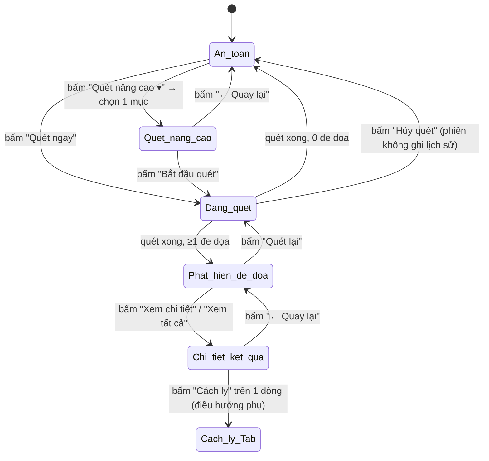

Bốn "màn hình" (a, b, c, d trong README) thực chất là **4 panel con trong cùng `UcTongQuan`**, chuyển đổi bằng cách ẩn/hiện (`Panel.Visible`) hoặc `Panel.BringToFront()` — **không** tạo Form mới, để giữ state của sidebar và tránh nháy giao diện. Đề xuất đặt tên control:

```
UcTongQuan
├── pnlAnToan            // (a)
├── pnlPhatHienDeDoa      // (b)
├── pnlChiTietKetQua      // (c)
└── pnlQuetNangCao        // (d)
```

Chỉ 1 panel `Visible = true` tại một thời điểm; `CurrentView` (enum `TongQuanView { AnToan, PhatHienDeDoa, ChiTiet, QuetNangCao }`) lưu trạng thái hiện tại để `MoTabTongQuan()` (được gọi từ `FrmMain`) biết mở lại đúng view.

---

## 2. Design tokens dùng chung

Tái sử dụng 100% từ `Theme.cs` — liệt kê lại để dev không phải đoán, và bổ sung token còn thiếu cần thêm vào `Theme.cs`:

| Token | Giá trị / nguồn | Dùng ở |
|---|---|---|
| `Theme.ColorPrimary` | `#0A3E8C` (xanh brand) | nút Primary, tiêu đề card |
| `Theme.ColorSuccess` | xanh lá (đã có, dùng ở badge/khiên an toàn) | icon ✓, số "Mối đe dọa: 0" |
| `Theme.ColorDanger` | đỏ (đã có, dùng cảnh báo) | icon `!`, số "Mối đe dọa: N", badge "Cao" |
| **`Theme.ColorWarningMedium`** *(mới)* | cam, vd `#F5A623` | badge "Trung bình" |
| **`Theme.ColorWarningLow`** *(mới)* | vàng, vd `#F1C40F` | badge "Thấp" |
| `Theme.FontPageTitle` | 18pt Bold | "Tổng quan", "Quét nâng cao", "Chi tiết kết quả quét" |
| `Theme.FontCardLabel` | 10.125 Bold | tiêu đề GroupBox/card |
| `Theme.BtnRole.Primary` | nền xanh, chữ trắng | "Quét ngay", "Bắt đầu quét", "Xem chi tiết" |
| `Theme.BtnRole.Secondary` | viền xanh, nền trắng | "Quét nâng cao", "Quét lại", "Chọn thư mục/tệp" |
| `Theme.BtnRole.Danger` | viền/nền đỏ | "Xóa tất cả" |
| **`Theme.StyleBadge(Level)`** *(mới, cần viết)* | trả `Color` + `string` theo enum `ThreatLevel { High, Medium, Low }` | mọi badge Mức độ |
| **`Theme.StyleRadioCard`** *(mới)* | style thẻ chọn chế độ (viền 1px `#E0E0E0` mặc định, viền 2px `ColorPrimary` + nền `#EAF1FC` khi chọn; dòng mô tả của thẻ đang chọn được tô `BlueDark`/`BlueTint` trong `HienThiNoiDungCheDo`) | 4 thẻ cột trái trang Quét nâng cao (luôn **đúng 1 thẻ** được chọn — xem §15.7 (x)) |
| Bo góc card | `8px` (theo card hiện có ở Lịch sử/Bảo vệ) | mọi card mới |
| Khoảng cách card | `16px` | grid 2 cột "Tùy chọn quét" |

> Không hard-code màu/font trực tiếp trong `UcTongQuan.Designer.cs` — luôn gọi `Theme.StyleXxx(control)` như quy ước ở đầu README, để pass được test `UiEndToEnd` mục 9b.

---

## 3. Đặc tả UI từng màn hình

> **(25/09/2026, lần 9) Dải loading quét là cấp TRANG, không thuộc một màn hình riêng**: `pnlLoadingQuet` nằm ở **hàng 0 của `tableLayoutPanel11`** (trên cả `tableLayoutPanel12`) nên hiện ở **cả 4 màn hình (a)/(b)/(c)/(d)** mỗi khi có phiên quét chạy: hàng `Absolute` 0px → **46px** + `Visible = true` trong `SetScanning(true)`, và về 0px khi phiên kết thúc (xem §15.7 (xiii)).

### 3.1 (a) `pnlAnToan`

| # | Control | Type | Spec |
|---|---|---|---|
| 1 | `picShield` | PictureBox | icon khiên ✓ xanh, 96×96, căn giữa ngang |
| 2 | `lblTieuDe` | Label | "Máy tính của bạn được bảo vệ", `ColorSuccess`, Bold 16pt |
| 3 | `lblPhuDe` | Label | "Không phát hiện mối đe dọa.", xám `#6B7280`, 10pt |
| 4 | `btnQuetNgay` *(code: `btnScanNow`)* | Button | `Theme.BtnRole.Primary`, icon ▶, text "Quét ngay"; `Click` → gọi `BatDauQuetNhanh()` (mục 6.1). **Chỗ đặt (lần 4):** trong `flowHeaderActions`, hàng 4 của `tlpAnToanText` — cạnh `btnQuetNangCao` (12px), cả hàng 52px nằm dưới tiêu đề + phụ đề, không còn dải header riêng ở đầu trang |
| 5 | `btnQuetNangCao` | Button (split/dropdown) | `Theme.BtnRole.Secondary`, icon ⚙ + text "Quét nâng cao" + chevron ▾; `Click` → `hienThiDropdownQuetNangCao()`; đứng sau `btnScanNow` trong `flowHeaderActions` (`FlowDirection.LeftToRight`) |
| 5b | `lblScanProgress` | Label | Dòng trạng thái quét — **con thứ 3** của `flowHeaderActions` (sau 2 nút, cách 22px; `AutoSize = false` + `AutoEllipsis = true` + `Size = (420, 20)` để chữ dài **cắt bằng "…"** chứ không đội bố cục, `TextAlign.MiddleLeft`, 8.25pt xám `#6B7280`), mặc định "Sẵn sàng quét". Thay dải `pnlScanStrip` đã gỡ (lần 4): `SetScanning(true)` → "Đang quét...", callback tiến độ → "Đang quét: <tệp>  (N tệp)", `ApDungKetQuaQuet` → "Hoàn tất — đã quét N tệp trong X giây." (xanh/hổ phách), hủy → "Đã hủy phiên quét.", lỗi → "Quét dừng vì lỗi.", VirusTotal → "Đang tính hash + tra cứu VirusTotal..." rồi "VirusTotal: <tóm tắt>" |
| 6 | `dropdownQuetNangCao` | ContextMenuStrip hoặc Popup Panel tùy custom | neo dưới `btnQuetNangCao`, 4 `MenuItem`: mỗi item render icon(24×24) + `title` (Bold) + `subtitle` (xám, 9pt) trên 2 dòng. `Click` từng item → `MoQuetNangCao(ScanMode)` với `ScanMode` tương ứng (`FullSystem`, `Folder`, `Files`, `Custom`) |
| 7 | `pnlThongKe` | Panel (3 cột) | 3 thẻ: `lblSoMoiDeDoa` (0, xanh) / `lblSoTepDaQuet` / `lblLanQuetGanNhat` — bind từ `ScanHistoryStore.GetLatestSession()` khi `Load`. Hàng này **chỉ thuộc Tổng quan (a)/(b)**; mở 2 màn hình riêng thì **ẩn hẳn** ở cả hai: **(c)** *Chi tiết kết quả quét* (lần 8 — xem §15.7 (xii)) và **(d)** *Quét nâng cao* (lần 5 — xem §15.7 (ix)) — `pnlThongKe.Visible = false` + hàng hạ về 0px |
| 8 | `dgvActivity` *(thay `lstHoatDongGanDay`)* | **Bảng cuộn được** (`Theme.StyleGrid`, cao 400px cùng hàng với thẻ): cột `colActMark` (chấm màu theo loại sự kiện) · `colActDesc` (mô tả ngắn) · `colActTime` (`dd/MM/yyyy HH:mm`), nạp **tối đa 100 dòng mới nhất** từ `ScanHistoryStore.Entries()` + `lblActivitySummary` ("N hoạt động gần nhất") + liên kết `lnkXemLichSu` → `FrmMain.MoTabLichSu()`. **Không còn thẻ "Tuỳ chọn quét nhanh"** trên trang này — xem ghi chú §15 |

**Sự kiện `Load` của panel:** đọc lại từ `ScanHistoryStore` mỗi lần panel được `BringToFront()` (không chỉ lúc mở app) để số liệu luôn mới sau khi quét xong quay lại.
**Trạng thái (a) chỉ còn 3 khối** (dải trạng thái cũ đã gỡ ở lần 4 — xem §15.7): khối trạng thái bảo vệ / **hero** (164px, gồm icon + tiêu đề + phụ đề + **hàng 4 của `tlpAnToanText`**: 2 nút `flowHeaderActions` và dòng chữ trạng thái quét `lblScanProgress` ngay cạnh chúng) · 3 thẻ số liệu (104) · thẻ *Hoạt động gần đây* (**`Percent 100`** — giãn hết phần cao còn lại của cửa sổ, sàn ≈ 303px khi cửa sổ ở min 980×640); hàng bảng đe dọa hạ về 0 và bị ẩn (`grpAction.Visible = false`).

### 3.2 (b) `pnlPhatHienDeDoa`

| # | Control | Spec |
|---|---|---|
| 1 | `picCanhBao` | icon `!` đỏ tròn, 96×96 |
| 2 | `lblTieuDe` | "Phát hiện {N} mối đe dọa", `ColorDanger`, Bold 16pt — `{N}` = `ScanResult.Threats.Count` |
| 3 | `lblPhuDe` | "Quá trình quét đã hoàn tất." |
| 4 | `btnXemChiTiet` | Primary — `Click` → `MoChiTietKetQua(lastScanResult)` |
| 5 | `btnQuetLai` | Secondary — `Click` → chạy lại **đúng** `ScanRequest` của phiên vừa rồi (không mở lại Quét nâng cao) |
| 6 | `pnlThongKe` | giống (a) nhưng `lblSoMoiDeDoa` màu đỏ, phụ đề "Tệp bị nhiễm" |
| 7 | `dgvActions` | DataGridView cao **400px**, **chỉ hiện ở trạng thái (b)** — hàng này thay đúng chỗ thẻ *Hoạt động gần đây* của (a) (ở (a) hàng hạ về 0 + `Visible = false`, xem §15). Cột: **Chọn** (checkbox, nhấp tiêu đề = chọn/bỏ chọn tất cả) · **Tệp** · **Mối đe dọa** · **Mức độ** (badge) · **Thao tác** (nút "Xem chi tiết" → mở (c) và tự chọn đúng dòng). Hàng nút dưới bảng: `Cách ly đã chọn` · `Xóa đã chọn` · `Cách ly tất cả` · `Tra VirusTotal` |
| 8 | `lnkXemTatCa` | LinkLabel góc phải trên `gridMoiDeDoa`, ẩn nếu `Threats.Count ≤ 5` — `Click` → `MoChiTietKetQua()` |

### 3.3 (c) `pnlChiTietKetQua`

| # | Control | Spec |
|---|---|---|
| 0 | *(trang riêng — không có hàng 3 thẻ số liệu)* | `HienThi(ChiTiet)` **ẩn hẳn** hàng 3 thẻ của §3.1 (`pnlThongKe.Visible = false` + hàng 1 của `tableLayoutPanel12` hạ `104 → 0`) — trang (c) **không** hiển thị thẻ *Mối đe dọa / Tệp đã quét / Lần quét gần nhất*; thông tin thời gian/loại quét đã có ở hàng 3 của bảng dưới. Quay lại (a)/(b) bằng `btnQuayLai` thì hàng trở lại đúng `104px` (xem §15.7 (xii)) |
| 1 | `btnQuayLai` | "← Quay lại" → `HienThi(TongQuanView.PhatHienDeDoa)` |
| 2 | `lblTieuDe` / `lblPhuDe` | "Chi tiết kết quả quét" / "Danh sách các mối đe dọa được phát hiện trong lần quét vừa rồi." |
| 3 | `lblThoiGianQuet`, `lblLoaiQuet` | góc phải trên, bind `ScanResult.StartedAt` (`dd/MM/yyyy HH:mm:ss`) và `ScanResult.ScanModeDisplayName` |
| 4 | `btnXuatBaoCao` | Secondary — xuất `.txt`/`.pdf` tóm tắt phiên (mục 7.3) |
| 5 | `gridChiTiet` | DataGridView đầy đủ: STT · Tên tệp · Đường dẫn · Mối đe dọa (tên định danh) · Mức độ (badge) · Hash SHA256 (rút gọn `xxxxxxxx…` + nút copy icon) · Thao tác (nút "Xem" + `SplitButton`/chevron mở menu Cách ly/Xóa/Tra VirusTotal cho **dòng đó**) |
| 6 | `tabChiTietDong` | `TabControl` 5 tab: **Thông tin chi tiết** (mặc định) · VirusTotal · Hành vi · Chuỗi ký tự · Thông tin bổ sung — nội dung load **lazy** khi đổi dòng chọn ở `gridChiTiet` (tránh tính SHA1/MD5 lại nếu đã cache trong `ScanResultItem`) |
| 7 | `pnlThongTinTep` (trong tab 1, card trái) | Tên tệp, Đường dẫn, Kích thước (`"{0:N2} MB ({1:N0} bytes)"`), Loại tệp, Thời gian tạo, Thời gian sửa đổi, MD5/SHA1/SHA256 + nút copy từng dòng (`Clipboard.SetText`) |
| 8 | `pnlVirusTotal` (trong tab 1, card phải) | Nếu **chưa tra VT** cho dòng này: hiện nút "Tra VirusTotal" thay vì donut. Nếu đã tra: donut `X/72` (vẽ bằng `Chart`/GDI+ arc, không cần lib ngoài), dòng kết luận, "Lần phân tích gần nhất", link rút gọn + copy, nút "Mở trên VirusTotal" → `Process.Start(url)` |

### 3.4 (d) `pnlQuetNangCao`

| # | Control | Spec |
|---|---|---|
| 0 | *(trang riêng — hàng 3 thẻ số liệu bị ẩn)* | `HienThi(QuetNangCao)` **ẩn hẳn** hàng 3 thẻ của §3.1 (`pnlThongKe.Visible = false` + hàng 1 của `tableLayoutPanel12` hạ `104 → 0`) — trang (d) **không** có thẻ *Mối đe dọa / Tệp đã quét / Lần quét gần nhất*; hàng (d) giãn `Percent 100` (xem §15.7 (ix)) |
| 1 | `btnQuayLai` | quay về view đã mở trang này (`AnToan` hoặc `PhatHienDeDoa`) |
| 2 | `lblTieuDe`/`lblPhuDe` | "Quét nâng cao" / "Chọn chế độ quét phù hợp với nhu cầu của bạn để kiểm tra và phát hiện các mối đe dọa." |
| 3 | `pnlCheDoTrai` | 4 `RadioCard` (`Theme.StyleRadioCard`): `FullSystem`, `Folder`, `Files`, `Custom` — mỗi thẻ là 1 container riêng nên WinForms **không** tự bỏ chọn thẻ cũ: mọi thay đổi trạng thái đi qua **`ChonTheCheDo(mode)`** (bật thẻ đang chọn + bỏ chọn 3 thẻ còn lại, cờ chống đệ quy `dangChonTheCheDo`) rồi mới `HienThiNoiDungCheDo(mode)` (đổi nội dung `pnlNoiDungPhai`, giữ dữ liệu đã nhập của từng chế độ trong bộ nhớ, **không** mất khi qua lại). Bấm vào **dòng mô tả** / thân thẻ cũng chọn thẻ đó; `↑`/`↓`/`←`/`→` đi qua lại giữa 4 thẻ (có quấn vòng); đang quét thì khoá cả 4 thẻ + dòng mô tả — xem §15.7 (x). **Bố cục 2 cột / 1 hàng ngang / lưới 2×2 tự xếp lại theo bề rộng vùng trang** (ngưỡng `NguongHaiCot = 1000`, `NguongMotHang = 800`) — xem §15.7 (xi) |
| 4 | `pnlNoiDungPhai` | container thay nội dung theo 4 sub-panel bên dưới; ở **bố cục hẹp** (bề rộng vùng trang < 1000px) khối này **xuống hàng dưới** (hàng 1) hàng thẻ và chiếm trọn bề ngang — xem §15.7 (xi) |
| 4.1 | `pnlFullSystem` | info-box xanh nhạt cố định + `chkListTuyChonFull` (7 checkbox, 2 cột, mỗi item có icon ⓘ với `ToolTip`) + `gridODia` (bind `DriveInfo.GetDrives()` lọc `DriveType.Fixed`, cột checkbox + Ổ đĩa + Loại + Tổng dung lượng + Dung lượng trống) |
| 4.2 | `pnlFolder` | `txtThuMuc` (readonly) + `btnChonThuMuc` (`FolderBrowserDialog`, thêm vào `gridThuMuc` chứ không ghi đè `txtThuMuc`) + `gridThuMuc` (STT/Đường dẫn/Kích thước/Thao tác) + `btnXoaTatCa` + `chkListTuyChonFolder` (6 checkbox) |
| 4.3 | `pnlFiles` | `pnlKeoTha` (custom `Panel` bắt `DragEnter`/`DragDrop`, `AllowDrop = true`) + `btnChonTep` (dropdown: "Chọn tệp" / có thể thêm "Chọn nhiều tệp") + `gridTep` (STT/Tên tệp+icon/Đường dẫn/Kích thước/Thao tác) + `btnXoaTatCa` + `chkListTuyChonFiles` (3 checkbox) |
| 4.4 | `pnlCustom` | `gridViTri` (STT/Đường dẫn/Loại/Thao tác) + `btnThemViTri▾` (menu: Thêm thư mục / Thêm tệp) + `btnXoaDong` + `btnXoaTatCa` + `radioLoaiTep` (5 lựa chọn, chọn `TuyChinh` mới enable `txtPhanMoRong`) + `chkListTuyChonCustom` (6 dòng, dòng cuối là `numBoQuaTepLon` + `cboDonVi` KB/MB/GB) |
| 5 | `pnlLuuY` | info-box, nội dung đổi theo `mode` (bảng câu chữ ở README mục d); ở **bố cục hẹp** nút *Bắt đầu quét* bị đẩy **xuống dưới** khối này và giãn hết bề ngang — §15.7 (xi) |
| 6 | `btnBatDauQuet` | Primary, góc dưới phải mọi sub-panel (bố cục rộng: `Dock = Right` ở hàng chân trang) — **disable** nếu danh sách vị trí/tệp trống (trừ `FullSystem` luôn có sẵn ổ đĩa) — xem mục 8; **bố cục hẹp**: `Dock = Fill` + xuống **dưới** `pnlLuuY` để không bị đẩy khỏi khung — §15.7 (xi) |

---

## 4. Mô hình dữ liệu (DTO)

```csharp
public enum ScanMode { QuickScan, FullSystem, Folder, Files, Custom }
public enum ThreatLevel { High, Medium, Low }
public enum CustomFileTypeFilter { All, Executable, Archive, Document, CustomExtensions }

public class ScanTarget
{
    public string Path { get; set; }
    public bool IsDirectory { get; set; }
    public long? CachedSizeBytes { get; set; }   // tính lazy, hiển thị "Đang tính..." nếu null
}

public class ScanOptions
{
    public bool DeepScan;                 // "Quét sâu"
    public bool ScanArchives;              // ZIP/RAR/7Z
    public bool ScanMemory;                // "Kiểm tra bộ nhớ đang hoạt động" (chỉ FullSystem)
    public bool ScanTempCache;             // "Quét trí nhớ tạm" (chỉ Folder)
    public bool DetectPUA;
    public bool ScanSystemAreas;           // chỉ FullSystem
    public bool UseBehaviorDetection;
    public bool AutoQuarantineOnDetect;
    public long? SkipFilesLargerThanBytes; // chỉ Custom
    public CustomFileTypeFilter FileTypeFilter = CustomFileTypeFilter.All; // chỉ Custom
    public string CustomExtensionsCsv;     // chỉ khi FileTypeFilter = CustomExtensions, vd "exe,dll,sys"
}

public class ScanRequest
{
    public ScanMode Mode;
    public List<ScanTarget> Targets;        // Folder/Files/Custom dùng; FullSystem dùng SelectedDrives
    public List<string> SelectedDrives;     // chỉ FullSystem, vd ["C:\\","D:\\"]
    public ScanOptions Options;
}

public class ScanResultItem
{
    public string FileName, FullPath, ThreatName;
    public ThreatLevel Level;
    public string Md5, Sha1, Sha256;
    public long SizeBytes;
    public DateTime CreatedAt, ModifiedAt;
    public VirusTotalReport VtReport;       // null nếu chưa tra
    public List<string> SuspiciousStrings;  // tab "Chuỗi ký tự"
    public List<string> BehaviorLogs;       // tab "Hành vi"
}

public class ScanResult
{
    public Guid SessionId;
    public ScanMode Mode;
    public DateTime StartedAt, FinishedAt;
    public int TotalFilesScanned;
    public List<ScanResultItem> Threats;
    public string ScanModeDisplayName => ...; // "Quét nhanh" / "Quét toàn bộ hệ thống" / "Quét thư mục" / "Quét tệp" / "Quét tùy chỉnh"
}
```

---

## 5. Luồng xử lý tệp (File handling flow)

Đây là phần người dùng thao tác **trước khi bấm "Bắt đầu quét"** — tất cả xảy ra hoàn toàn ở UI thread (chưa quét), chỉ xây dựng `ScanRequest.Targets`.

### 5.1 Thêm tệp qua nút "Chọn tệp" (pnlFiles)

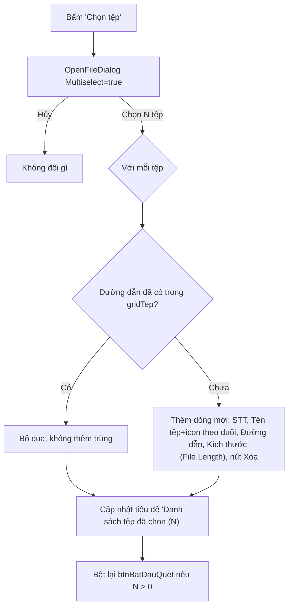

* Icon theo đuôi tệp: map tĩnh `{.exe/.dll→icon máy, .pdf→icon pdf đỏ, .zip/.rar/.7z→icon nén, khác→icon tệp chung}`.
* Không giới hạn số lượng tệp chọn cùng lúc trong dialog; giới hạn tổng số dòng hiển thị trong spec UI có thể để **không giới hạn** — grid tự scroll.

### 5.2 Kéo–thả tệp/thư mục (`pnlKeoTha`)

```mermaid
flowchart TD
    A["DragEnter"] --> B{"e.Data.GetDataPresent(DataFormats.FileDrop)?"}
    B -->|Không| C["e.Effect = None (con trỏ cấm)"]
    B -->|Có| D["e.Effect = Copy, đổi viền pnlKeoTha sang xanh (hover state)"]
    D --> E["DragDrop: lấy string[] paths = (string[])e.Data.GetData(DataFormats.FileDrop)"]
    E --> F{"Với mỗi path"}
    F --> G{"Directory.Exists(path)?"}
    G -->|Có, và đang ở tab Quét tệp| H["Bỏ qua + Toast: 'Chỉ nhận tệp ở chế độ Quét tệp, dùng Quét thư mục để thêm thư mục'"]
    G -->|Có, và đang ở tab Quét tùy chỉnh| I["Thêm vào gridViTri với Loại = Thư mục"]
    G -->|Không (là tệp)| J["Áp cùng logic dedupe như mục 5.1 (D/E/F)"]
    H --> K["DragLeave: trả viền pnlKeoTha về mặc định"]
    I --> K
    J --> K
```

Ở `pnlFolder`, vùng thả kéo tương tự có thể tái dùng cùng handler nhưng chỉ chấp nhận `Directory.Exists`, còn lại báo lỗi tương tự.

### 5.3 Thêm thư mục ("Chọn thư mục" / "Thêm vị trí")

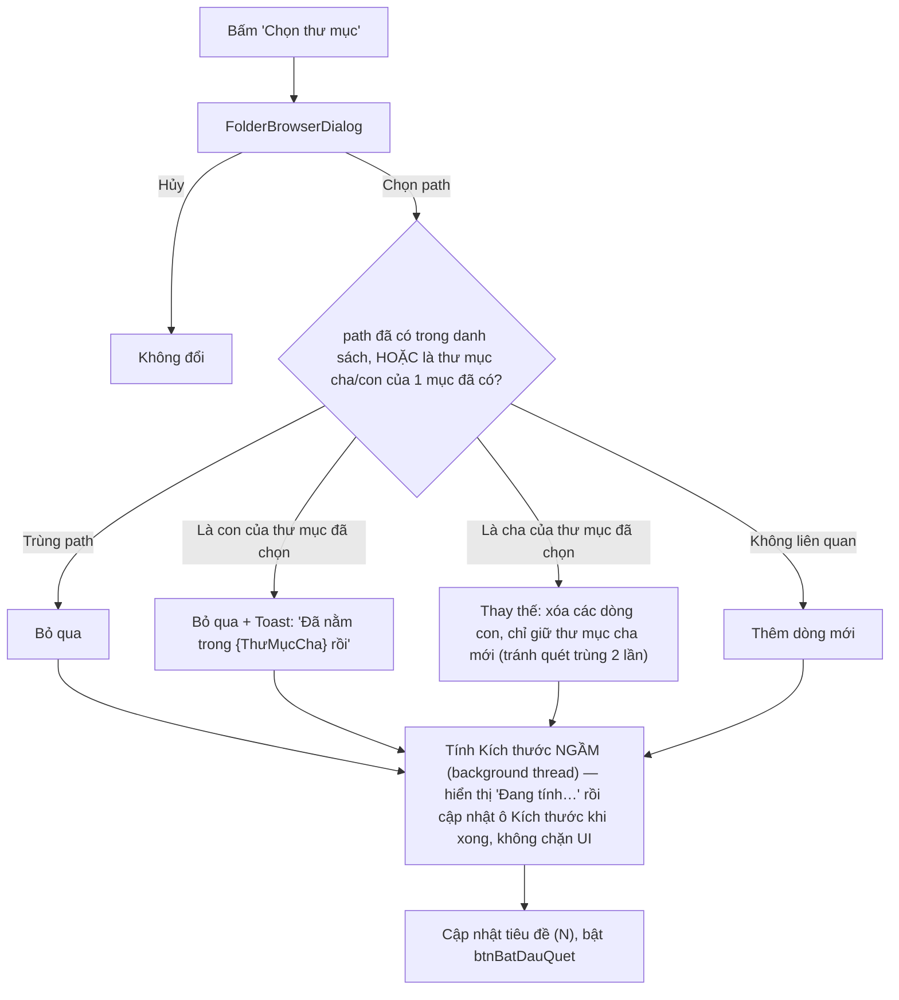

* Tính kích thước dùng `Task.Run(() => DirectorySizeCalculator.GetSizeRecursive(path, ct))`, có `CancellationToken` hủy nếu người dùng xóa dòng trước khi tính xong.
* `DirectorySizeCalculator` nên bỏ qua lỗi `UnauthorizedAccessException` từng thư mục con (cộng dồn phần đọc được, không crash cả phép tính).

### 5.4 Xóa dòng / Xóa tất cả

* Nút xóa từng dòng (icon 🗑 trong cột Thao tác): xóa khỏi `List<ScanTarget>` tương ứng + `grid.Rows.Remove`; nếu đang tính size nền cho dòng đó → hủy `CancellationTokenSource` của dòng đó.
* "Xóa tất cả": `grid.Rows.Clear()` + `targets.Clear()` + hủy mọi phép tính size đang chạy + cập nhật tiêu đề về "(0)" + **disable** `btnBatDauQuet`.
* Không có hộp xác nhận cho "Xóa" từng dòng (thao tác nhẹ, dễ thêm lại); "Xóa tất cả" **có** hộp xác nhận Yes/No nếu danh sách ≥ 3 mục (tránh xóa nhầm danh sách dài).

### 5.5 Quét tùy chỉnh — riêng "Loại tệp quét" + "Tùy chỉnh phần mở rộng"

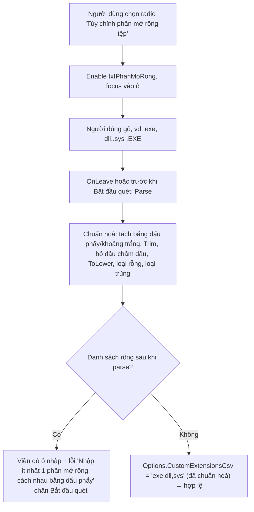

* Đổi sang radio khác (`Tất cả tệp`, `Chỉ tệp thực thi`…) → **disable** (không xóa nội dung) `txtPhanMoRong`, để người dùng quay lại không mất input.
* `CustomFileTypeFilter.Executable` map cứng `.exe,.dll,.sys,.bat,.cmd,.scr,.com`; `.Archive` → `.zip,.rar,.7z`; `.Document` → `.doc,.docx,.pdf,.xls,.xlsx,.ppt,.pptx`.

### 5.6 Validate trước khi "Bắt đầu quét"

`btnBatDauQuet.Enabled` được tính lại (hàm `CapNhatTrangThaiNutBatDauQuet()`) mỗi khi danh sách/tùy chọn đổi:

| Mode | Điều kiện hợp lệ |
|---|---|
| `FullSystem` | ít nhất 1 ổ đĩa được tick trong `gridODia` |
| `Folder` | `gridThuMuc.Rows.Count > 0` |
| `Files` | `gridTep.Rows.Count > 0` |
| `Custom` | `gridViTri.Rows.Count > 0` **và** (nếu `FileTypeFilter = CustomExtensions` thì `txtPhanMoRong` parse hợp lệ theo 5.5) |

Nếu không hợp lệ: nút `btnBatDauQuet` disable (xám) — **không** dùng MessageBox chặn, để trải nghiệm mượt hơn (theo đúng tinh thần "không có nút xóa một-nhấp" / hạn chế popup của phần còn lại trong app).

---

## 6. Luồng thực thi quét

### 6.1 "Quét ngay" (Quick Scan, từ trạng thái an toàn)

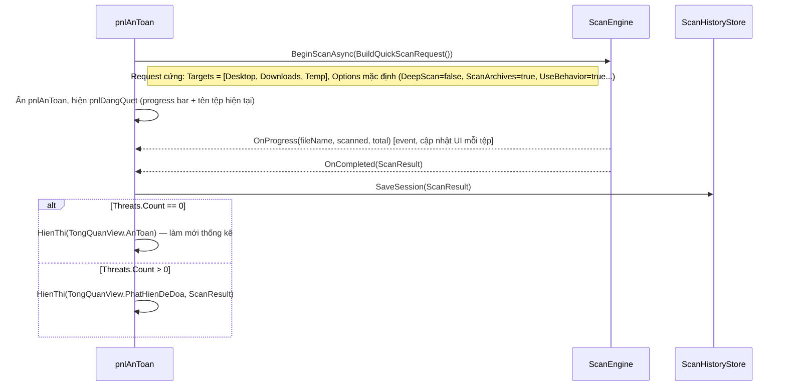

### 6.2 "Bắt đầu quét" từ trang Quét nâng cao

Giống 6.1 nhưng `ScanRequest` build từ `ScanTargets`/`Options` đã nhập ở mục 5, theo `ScanMode` đang chọn. Sau khi bấm:

1. `btnBatDauQuet` disable ngay + đổi UI sang `pnlDangQuet` dùng chung với Quick Scan (progress, "Hủy quét").
2. Nếu người dùng bấm "Hủy quét" giữa chừng → `Engine.CancelScan(sessionId)` → **không gọi** `Hist.SaveSession` (giữ đúng hành vi hiện có ở README: "phiên dừng an toàn, lịch sử không ghi phiên dở") → quay về view đã mở trang Quét nâng cao (không quay lại pnlAnToan, để người dùng chỉnh lại rồi quét tiếp nếu muốn).
3. Quét xong → giống 6.1 bước cuối (rẽ nhánh AnToan/PhatHienDeDoa).

### 6.3 Pipeline xử lý từng tệp trong `ScanEngine` (không đổi, chỉ liệt kê lại để UI hiểu dữ liệu trả về)

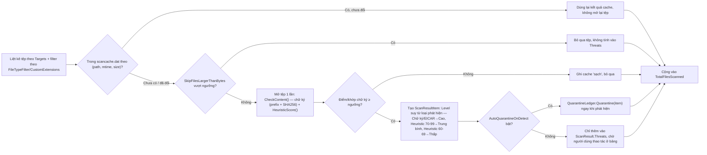

Quy tắc gán `ThreatLevel` (đề xuất, cần đối chiếu đúng số của `ScanEngine.HeuristicScore` hiện tại):

| Nguồn phát hiện | `ThreatLevel` |
|---|---|
| Khớp chữ ký / hash EICAR / VirusTotal ≥ 2 vendor báo độc | `High` |
| Heuristic 80–100/100 | `High` |
| Heuristic 65–79/100 | `Medium` |
| Heuristic 60–64/100 | `Low` |

### 6.4 Thao tác trên bảng kết quả (Cách ly / Xóa / Tra VirusTotal) — tại (b) và (c)

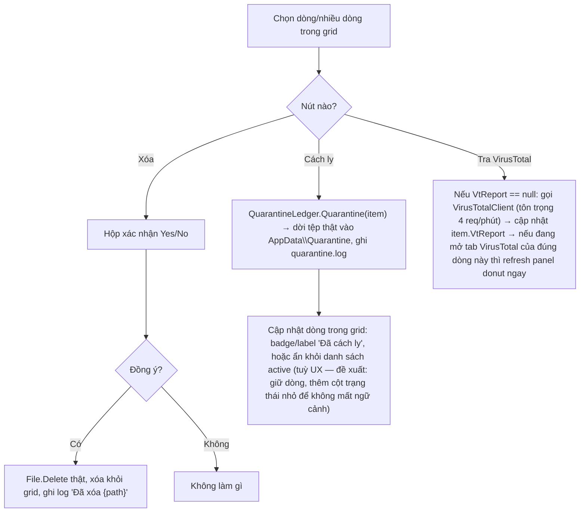

---

### 6.5 Luồng xử lý trang "Chi tiết kết quả quét" (c)

Trang (c) nhận vào `ScanResult` của phiên vừa quét (hoặc phiên cũ mở lại từ Lịch sử — xem 6.5.7) + `selectedItemId` tuỳ chọn (khi mở từ nút "Xem chi tiết" của 1 dòng cụ thể ở (b)).

#### 6.5.1 Mở trang & chọn dòng mặc định

```mermaid
sequenceDiagram
    participant B as pnlPhatHienDeDoa
    participant C as pnlChiTietKetQua
    participant Grid as gridChiTiet
    participant Panel as tabChiTietDong

    B->>C: MoChiTietKetQua(scanResult, selectedItemId?)
    C->>C: HienThi(TongQuanView.ChiTiet)
    C->>Grid: DataSource = scanResult.Threats (bind toàn bộ, không phân trang)
    C->>Grid: lblThoiGianQuet = scanResult.StartedAt; lblLoaiQuet = scanResult.ScanModeDisplayName
    alt selectedItemId có giá trị
        C->>Grid: chọn đúng dòng đó (CurrentCell/Select Row), cuộn tới nếu ngoài viewport
    else không có
        C->>Grid: chọn dòng đầu tiên (index 0) mặc định
    end
    Grid->>Panel: RowEnter/SelectionChanged → NapPanelChiTiet(selectedThreat)
    Panel->>Panel: mở lại tab "Thông tin chi tiết" (tab mặc định, kể cả nếu trước đó đang ở dòng khác dừng ở tab khác)
```

* `gridChiTiet` set `SelectionMode = FullRowSelect`, `MultiSelect = false` — chỉ xem chi tiết **1 dòng tại một thời điểm** (khác với bảng ở tab Lịch sử vốn cho chọn nhiều để xóa hàng loạt).
* Đổi dòng chọn → luôn reset panel về tab đầu tiên, tránh tình huống người dùng tưởng đang xem "Hành vi" của dòng cũ.

#### 6.5.2 Nạp panel chi tiết theo dòng đang chọn — load **lazy** từng tab

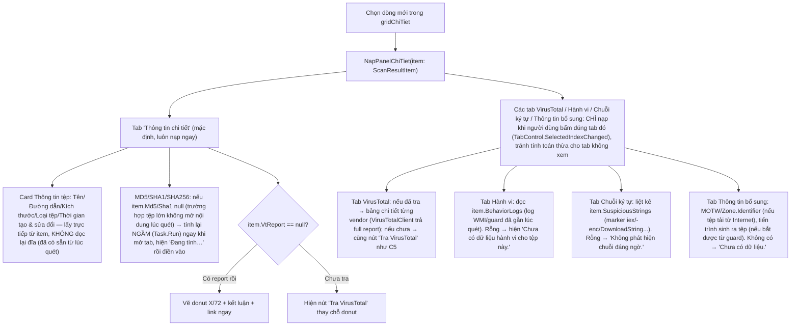

* Kết quả từng tab nên **cache theo `item.FullPath`** trong bộ nhớ phiên (Dictionary) để đổi qua đổi lại dòng/tab không phải tính lại (đặc biệt MD5/SHA1 của tệp lớn).
* Không bao giờ hiện số liệu bịa nếu không có — luôn "Chưa có dữ liệu" thay vì để trống hoặc giả định (đúng nguyên tắc README).

#### 6.5.3 Sao chép Hash / mở link VirusTotal

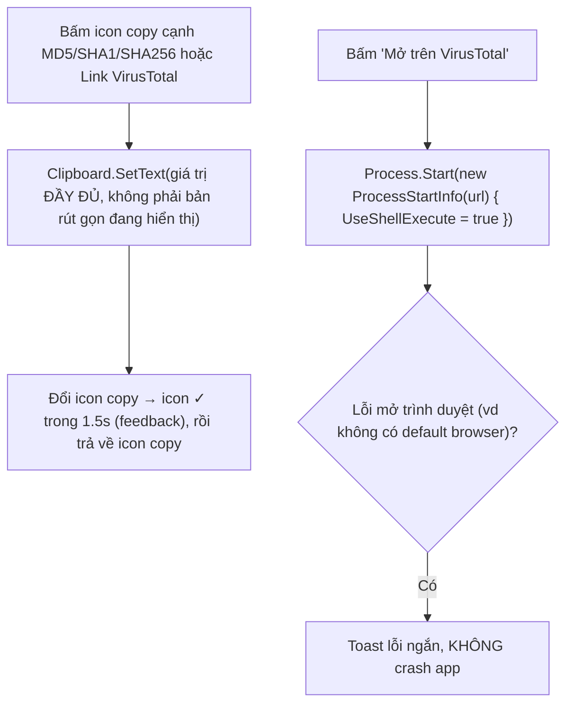

#### 6.5.4 Thao tác theo dòng ngay trong bảng chi tiết (nút "Xem" + chevron dropdown)

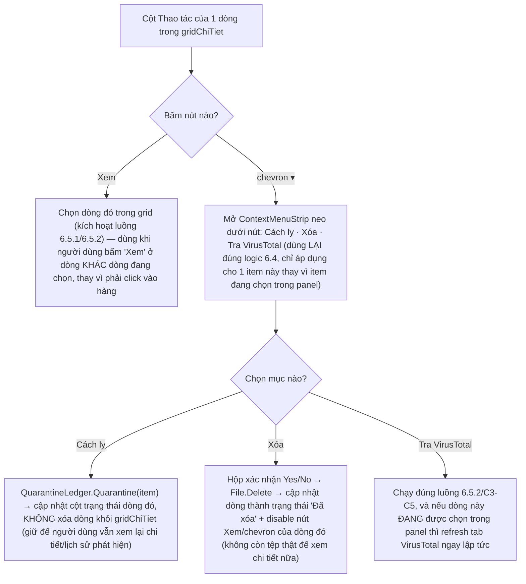

#### 6.5.5 Xuất báo cáo (nút "Xuất báo cáo")

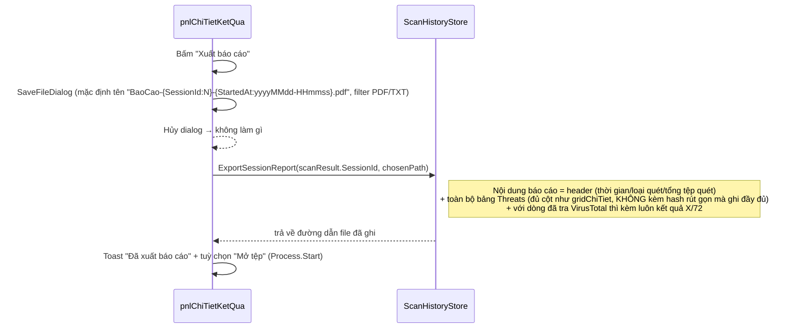

* Khác với "Xuất CSV" ở tab Lịch sử (xuất **toàn bộ lịch sử nhiều phiên**, phẳng, để mở Excel), "Xuất báo cáo" ở đây chỉ xuất **1 phiên đang xem**, định dạng đọc được (PDF ưu tiên, TXT dự phòng nếu chưa có lib PDF sẵn trong project) — 2 luồng dùng chung data (`ScanHistoryStore`) nhưng khác tầng trình bày.

#### 6.5.6 Quay lại (b) — có mất lựa chọn không?

Bấm "← Quay lại": `HienThi(TongQuanView.PhatHienDeDoa)`. **Không** cần nhớ dòng đang chọn ở (c) vì (b) chỉ hiển thị tối đa 5 dòng đầu, không có khái niệm "dòng đang chọn" — nhưng **phải** đồng bộ lại (b) nếu người dùng vừa Cách ly/Xóa 1 dòng ở (c): số liệu "Mối đe dọa: N" ở thẻ thống kê và bảng rút gọn của (b) phải đọc lại từ `scanResult.Threats` (đã cập nhật trạng thái) khi quay lại, không dùng snapshot cũ trước khi vào (c).

#### 6.5.7 Mở lại trang chi tiết từ Lịch sử (luồng phụ, không qua (b))

Tab Lịch sử (`UcLichSu`) khi bấm "Xem chi tiết" một dòng lịch sử **là phiên quét có đe dọa**, nên điều hướng thẳng sang `UcTongQuan.pnlChiTietKetQua` bằng cùng hàm `MoChiTietKetQua(scanResult)` (nạp lại `ScanResult` từ `scanhistory.log` theo `SessionId` thay vì từ bộ nhớ phiên hiện tại). Khi đó nút "← Quay lại" ở (c) phải quay về **tab Lịch sử**, không phải (b) — cần truyền thêm cờ `cameFrom` (`TongQuanView.PhatHienDeDoa` hoặc `HistoryTab`) vào `MoChiTietKetQua()` để biết quay lại đúng chỗ.

---

## 7. Ánh xạ sang code hiện có


| Việc cần làm | Service/hàm tái dùng | Cần viết mới? |
|---|---|---|
| Quét theo `ScanRequest` bất kỳ (mọi mode) | `ScanEngine.ScanAsync(IEnumerable<string> paths, ScanOptions)` | Có thể cần overload nhận `ScanOptions` mới (hiện `ScanEngine` có thể chưa có tham số PUA/ScanMemory/SkipLargerThan) |
| Lưu lịch sử phiên | `ScanHistoryStore.SaveSession(...)` | Không, chỉ truyền thêm `ScanMode` để hiển thị đúng "Loại quét" ở (c) |
| Cách ly / khôi phục | `QuarantineLedger` | Không |
| Tra VirusTotal | `VirusTotalClient.GetReportAsync(sha256)` | Không |
| Danh sách ổ đĩa cố định | `DriveInfo.GetDrives()` (BCL) | Viết hàm lọc `DriveType.Fixed` trong `UcTongQuan` hoặc `Services/SystemInfo.cs` mới |
| Tính kích thước thư mục đệ quy nền | — | **Mới**: `Services/DirectorySizeCalculator.cs` (async, hủy được, bỏ qua lỗi quyền) |
| Badge màu theo `ThreatLevel` | — | **Mới**: `Theme.StyleBadge(ThreatLevel)` |
| Xuất báo cáo 1 phiên (nút "Xuất báo cáo") | có thể tái dùng logic `ExportCsv` của `UcLichSu` nhưng lọc theo 1 `SessionId` và đổi định dạng (txt/pdf tóm tắt thay vì CSV thô) | **Mới**: `ScanHistoryStore.ExportSessionReport(sessionId, path)` |
| Drag & drop tệp/thư mục | WinForms `DragEnter`/`DragDrop` (BCL) | Viết handler trong `pnlQuetNangCao` |

---

## 8. Bảng validate / edge case

| Tình huống | Xử lý |
|---|---|
| Kéo–thả tệp **không tồn tại** nữa (đã bị xóa ngoài Explorer ngay lúc thả) | Bỏ qua path đó, không thêm dòng, không báo lỗi ồn ào (chỉ log nội bộ) |
| Thêm 2 lần cùng 1 tệp/thư mục | Dedupe theo `Path.GetFullPath(...).ToLowerInvariant()` — không thêm dòng trùng |
| Thêm thư mục **cha** sau khi đã thêm thư mục **con** | Gộp: xóa các dòng con, giữ 1 dòng cha (tránh quét lặp) — xem 5.3 |
| Tệp đang bị khóa bởi tiến trình khác khi quét tới | `ScanEngine` bắt `IOException`, ghi `ScanResultItem` phụ dạng "Không thể mở tệp (đang được sử dụng)" **hoặc** bỏ qua tuỳ policy hiện có — cần giữ nguyên hành vi hiện tại của `ScanEngine`, chỉ UI hiển thị nếu có |
| `SkipFilesLargerThanBytes` loại bỏ đúng tệp mã độc (edge case hiếm) | Chấp nhận đánh đổi hiệu năng — hiển thị số tệp bị bỏ qua ở cuối phiên (thêm dòng nhỏ "N tệp bị bỏ qua do vượt giới hạn kích thước" dưới progress khi quét xong, không bắt buộc nhưng khuyến nghị) |
| Ổ đĩa bị rút (USB) giữa lúc đang quét `FullSystem` | Bắt lỗi theo thư mục gốc ổ đó, tiếp tục các ổ còn lại, không crash phiên |
| Đường dẫn quá dài (> 260 ký tự, hệ thống cũ) | Bọc bằng `\\?\` prefix khi gọi I/O nếu `ScanEngine` chưa hỗ trợ; nếu không hỗ trợ được thì bỏ qua + log |
| Người dùng đổi `mode` (vd Folder → Files) khi đang tính size nền cho Folder | Hủy `CancellationTokenSource` đang chạy của mode cũ trước khi chuyển UI, tránh cập nhật nhầm vào panel không còn hiển thị |
| Bấm "Bắt đầu quét" 2 lần liên tiếp rất nhanh (double click) | `btnBatDauQuet` tự disable ngay khi `Click` đầu tiên tới lúc chuyển sang `pnlDangQuet` |
| Danh sách tệp/thư mục rất dài (vài nghìn dòng) trong grid | Dùng `DataGridView` ở chế độ `VirtualMode` hoặc data-bound `BindingList<T>` để tránh giật UI khi thêm hàng loạt qua kéo–thả thư mục lớn |

---

> Tài liệu spec này bổ sung chi tiết implement cho phần mô tả tổng quan đã có trong `README.md`; khi code thực tế lệch với spec (vd tên hàm `ScanEngine` khác), cập nhật lại bảng mục 7 để 2 tài liệu không lệch nhau.


---

## 9. Phạm vi bổ sung: 5 tab chi tiết theo ảnh tham chiếu

**Chế độ:** `MockUiMode` dùng fixture `scan-details.mock.json` trước khi kết nối SQL Server. Giữ WinForms thuần, dùng `Panel`, `TableLayoutPanel`, `DataGridView`, `TabControl`, `Button`, `TextBox`, `ComboBox`, `CheckBox`, `Label`, `ContextMenuStrip`, `ToolTip`; donut và sơ đồ hành vi vẽ bằng `Control.OnPaint`/GDI+, không cài thư viện UI. Không thay đổi layout các màn hình quét khác. `pnlChiTietKetQua` chứa header cố định + grid cao khoảng 150–190 px + hàng tab + vùng nội dung co giãn `Dock=Fill`; tránh scroll toàn trang nếu có thể.

### 9.1 Mô hình dữ liệu / repository

- `IScanDetailRepository.GetScan(long scanId)`, `GetDetections(long scanId)`, `GetDetection(long detectionId)`, `GetVirusTotal(long detectionId)`, `GetBehavior(long detectionId)`, `GetStrings(long detectionId)`, `GetAdditional(long detectionId)`. API có thể async cho production; mock đọc JSON một lần, cache theo `detectionId`.
- `MockScanDetailRepository` deserialize fixture thành `ScanDetailDto`, `DetectionDetailDto`, `VirusTotalDto`, `BehaviorDto`, `ExtractedStringDto`, `AdditionalInfoDto`; `SqlScanDetailRepository` về sau map từ CSDL thật và service bổ sung. Dùng ID thay vì chỉ số hàng; mỗi lần đổi selection hủy/bỏ qua kết quả load cũ bằng `CancellationToken` hoặc request version.
- Phân biệt `NotRequested`, `Loading`, `Ready`, `NoData`, `Error`; `0/72` là `Ready`, **không** phải `NoData`. Trong mock không phát HTTP hoặc thao tác tệp thật. Hash của fixture sinh từ chuỗi tên mẫu, chỉ kiểm tra nút copy, **không** xác nhận file thật.

### 9.2 Bảng và thanh điều hướng chung

`gridChiTiet` gồm STT, Tên tệp, Đường dẫn, Mối đe dọa, Mức độ, SHA256 rút gọn, nút Xem, nút mũi tên. `SelectionChanged` cập nhật `selectedDetectionId`, reset trang chuỗi về 1 và hiển thị nội dung tab đang mở; các tab khác lazy-load khi chọn. `Xem` chỉ chọn dòng. Menu Cách ly/Xóa/Tra VirusTotal trong mock chỉ đổi DTO in-memory và hiển thị toast `Mô phỏng`; không làm thay đổi tệp thật. Khi chạy thật, phải yêu cầu xác nhận trước khi xóa. Header lấy thời gian, loại quét từ `ScanDetailDto`; xuất báo cáo mock ghi rõ `DỮ LIỆU MẪU - KHÔNG PHẢI KẾT QUẢ QUÉT THỰC TẾ`.

## 10. Đặc tả từng tab

### 10.1 `tabThongTinChiTiet`

Hai card bằng `TableLayoutPanel` 2 cột. Card trái: tên, full path (tooltip), bytes và MB, loại tệp, ngày tạo/sửa, MD5/SHA1/SHA256 với nút copy riêng; nếu hash null thì `Chưa có dữ liệu` và disable copy. Card phải: tiêu đề VirusTotal, donut `malicious/total`, số lượng, `lastAnalysisAt`, URL từ SHA256 và nút Mở trên VirusTotal. Chỉ hiển thị donut nếu `state=MockResult` hoặc dữ liệu production hợp lệ; `NoData` hiển thị nút tra cứu khi đang ở chế độ thật.

### 10.2 `tabVirusTotal`

Hàng đầu: donut + mô tả bên trái; metadata tệp và nút xem web bên phải. Hàng bộ lọc: `Tất cả (N)`, `Phát hiện (M)`, `Không phát hiện (N-M)`, `txtTimKiemEngine`; bảng STT/Công cụ/Kết quả/Tên phát hiện/Phiên bản/Cập nhật. `malicious` đếm phát hiện; `undetected` đếm không phát hiện; các trạng thái `suspicious`, `harmless`, `timeout`, `failure` phải có nhãn riêng khi nối thật, không ép vào nhóm không phát hiện. Fixture demo chỉ có malicious và undetected. Lọc và search (không phân biệt hoa thường) chạy trên cùng danh sách gốc, không đổi thống kê donut. Không tự khẳng định sạch khi 0 phát hiện.

### 10.3 `tabHanhVi`

Bố cục 2×2: timeline bên trái trên; sơ đồ bên phải trên; chi tiết tiến trình trái dưới; hành vi nổi bật phải dưới. Timeline hiển thị timestamp/type/detail/level từ fixture, không tự tạo log. Sơ đồ vẽ các node **chỉ từ quan hệ đã có dữ liệu** (ví dụ `setup.exe` → `powershell.exe`, `temp.dll`, `185.199.111.153` theo event); node không có dữ liệu không vẽ. `BehaviorDto.state=NoData` → cả bốn vùng có trạng thái trống, không hiển thị quy kết nguy hiểm. Chọn event tô sáng và hiện chi tiết. IP/URL mock chỉ là chữ, không thực hiện kết nối.

### 10.4 `tabChuoiKyTu`

Bảng STT/Chuỗi ký tự/Loại/Đánh giá; thanh tìm kiếm + ComboBox loại + checkbox chỉ nghi ngờ + checkbox phân biệt hoa thường. Card bên phải hiển thị chuỗi được chọn, loại, đánh giá, lý do/ngữ cảnh, offset, các dòng xung quanh nếu có. `pageSize=10`, số trang tính sau lọc; khi đổi bộ lọc reset về trang 1; nút copy chép **toàn bộ** chuỗi không phải phần text rút gọn. `total` phải khớp độ dài danh sách nếu không có tổng phân tích riêng; fixture demo `setup.exe` có 10 mục. Không trích xuất tệp thật trong mock.

### 10.5 `tabThongTinBoSung`

Bố cục 2×2: (1) Thông tin hệ thống: máy, OS, người dùng, thời gian phát hiện, phần mềm quét, loại quét, trạng thái; (2) Thuộc tính tệp: tên, đường dẫn, bytes, loại, tạo/sửa/truy cập nếu có, thuộc tính, chủ sở hữu, quyền; (3) Mạng liên quan: IP, domain, port, protocol, quốc gia, ASN **chỉ nếu có log thực/mẫu**; (4) Chữ ký & nhận dạng: 3 hash, PDB, compiler, chữ ký số. `NoData` hiển thị `Chưa có dữ liệu`, không đoán quốc gia/ASN/compiler. `Mở thư mục chứa` chỉ bật nếu `Directory.Exists`; mock trên máy dev khác thường phải disable.

## 11. Contract fixture và kiểm tra dữ liệu

Tệp `scan-details.mock.json` gồm `_notice`, `schemaVersion`, `scan`, `detections[]`. Mỗi detection gồm `detectionId`, `scanId`, `signatureId`, `file`, `threat`, `virusTotal`, `behavior`, `strings`, `additional`. `file` chứa hash và metadata; `virusTotal.engines[]` chứa `engine`, `category`, `result`, `engine_version`, `engine_update`; `behavior.events[]` chứa `at`, `type`, `detail`, `level`; `strings.entries[]` chứa `value`, `kind`, `assessment`, `offset`, `context`. Trạng thái `NoData` không được render dữ liệu cũ của hàng trước. Không sử dụng mẫu này làm nguồn chữ ký chống virus.

## 12. Ánh xạ CSDL thật (không sửa schema hiện có)

| DTO/UI | Nguồn hiện có | Chưa có trong schema |
|---|---|---|
| Phiên quét | `ScanHistory.ScanID`, `ScanType`, `StartedAt`, `CompletedAt`, `FilesScanned`, `ThreatCount`, `ResultStatus` | — |
| Bảng phát hiện | `ThreatDetections.DetectionID`, `ScanID`, `SignatureID`, `FileName`, `OriginalPath`, `ThreatName`, `DetectedAt`, `FileSizeBytes`, `FileSHA256`, `Status`, `ActionTaken` | — |
| Hash/Severity | `ThreatDetections.FileMD5/FileSHA1/FileSHA256`; `VirusSignatures.Severity` qua `SignatureID` | metadata tạo/sửa, thuộc tính/owner |
| VirusTotal | `ThreatDetections.FileSHA256` để tra hash bằng `VirusTotalClient` | report cache, kết quả từng engine, phiên bản/cập nhật |
| Hành vi | Service giám sát nếu có và **thực sự ghi nhận** | timeline/process tree/network event bền vững |
| Chuỗi ký tự | Heuristic marker nếu engine thực sự trả về | offset/ngữ cảnh/danh sách trích xuất bền vững |
| Thông tin bổ sung | `DetectedAt`, đường dẫn, kích thước, hash, trạng thái | OS/owner/permissions/PDB/signature/network metadata |

**Chuyển đổi:** `MockUiMode=false` → `SqlScanDetailRepository`; không chèn mock vào 4 bảng thật. Nếu cần lưu chi tiết dài hạn, thiết kế migration bổ sung các bảng riêng có FK `DetectionID` (VT reports/engines, behavior events, extracted strings, metadata) và bảo đảm dữ liệu chưa có trả `NoData`. Không khẳng định chức năng ghi nhận hành vi, strings hoặc mạng đã tồn tại nếu code thực tế chưa cung cấp.

## 13. Checklist nghiệm thu UI/mock

- [ ] Đổi lần lượt 3 hàng, mở đủ 5 tab, dữ liệu đồng bộ theo `detectionId`; không giữ dữ liệu cũ.
- [ ] Tab VirusTotal `setup.exe`: 42 malicious + 30 undetected trên 72 engine mock; lọc/tìm kiếm đúng.
- [ ] Tab Hành vi: timeline và sơ đồ `setup.exe` có 5 event; hàng không có event hiển thị trống.
- [ ] Tab Chuỗi: 10 chuỗi demo, filter/search/copy/phân trang; chọn hàng thay card chi tiết.
- [ ] Tab Thông tin bổ sung: 4 card, mọi giá trị null/NoData hiển thị placeholder.
- [ ] Không thực hiện HTTP, không xóa/cách ly tệp thật, không ghi SQL trong mock.
- [ ] `Xuất báo cáo` gắn nhãn mock; `Mở thư mục chứa` không mở đường dẫn không tồn tại.
- [ ] Sau khi thay repository, UI giữ nguyên; kết quả thiếu thông tin không bị dựng giả.


---


---

# Phụ lục đặc tả triển khai — 5 tab Chi tiết kết quả quét (24/09/2026)

**Mức ưu tiên:** khi phần đặc tả cũ chỉ nêu tab chung chung hoặc khác bố cục, dùng phần này và 5 ảnh người dùng làm chuẩn UI. **Ràng buộc:** WinForms thuần, .NET Framework 4.7.2 theo project hiện có, không thư viện giao diện ngoài, không thay đổi schema SQL Server hiện tại. Tất cả kết quả `scan-details.mock.json` phải có nhãn mock trong môi trường kiểm thử.

## A. Cấu trúc control và vòng đời

```text
UcTongQuan
└─ pnlChiTietKetQua (Dock=Fill, AutoScroll=true)
   ├─ pnlHeader: btnQuayLai, lblTitle, lblSubtitle, lblScanTime, lblScanType, btnXuatBaoCao
   ├─ dgvDetections: STT, FileName, OriginalPath, ThreatName, Severity, SHA256, Actions
   └─ tabDetails: TabControl [tabThongTinChiTiet, tabVirusTotal, tabHanhVi, tabChuoiKyTu, tabThongTinBoSung]
      ├─ tabThongTinChiTiet: tlpTwoColumns -> cardFileInfo, cardVtSummary
      ├─ tabVirusTotal: tlpSummary -> cardVtStats, cardVtFile; pnlVendorFilter; dgvVendors
      ├─ tabHanhVi: tlp2x2 -> cardTimeline, cardGraph, cardProcess, cardHighlights
      ├─ tabChuoiKyTu: tlpTwoColumns -> cardStringList, cardStringDetail
      └─ tabThongTinBoSung: tlp2x2 -> cardSystem, cardFileProperties, cardNetwork, cardIdentity
```

Sử dụng `Panel`, `TableLayoutPanel`, `DataGridView`, `TabControl`, `Label`, `Button`, `TextBox`, `ComboBox`, `CheckBox`, `ContextMenuStrip`, `ToolTip`; donut và sơ đồ vẽ bằng `Control.OnPaint`/`System.Drawing` với `DoubleBuffered=true`. Không chỉnh sửa thủ công `InitializeComponent` trùng với Designer; tạo control theo một chiến lược nhất quán. Màu nền trắng/xanh rất nhạt, primary `#0A3E8C`, tab active xanh và gạch chân, badge đỏ/cam/vàng/xanh. Hai cột chia ~55/45 ở tab 1, 50/50 ở tab VT, 55/45 ở tab chuỗi; tab hành vi/bổ sung chia 2×2. `MinimumSize` và `AutoScroll` bảo đảm không cắt control khi cửa sổ thu nhỏ.

**State:** `SelectedScanId`, `SelectedDetectionId`, `SelectedDetailTab`, `SelectedVendorFilter`, `VendorSearch`, `StringSearch`, `StringTypeFilter`, `SuspiciousOnly`, `CaseSensitive`, `StringPage`, `SelectedStringId`. `dgvDetections.SelectionChanged` chỉ gọi `BindDetection(id)` khi id khác; không tạo lại toàn bộ tab mỗi lần. `tabDetails.SelectedIndexChanged` gọi `EnsureLoaded(tab, detectionId)` lazy, cache theo `(detectionId, tab, mockVersion)`; xóa cache khi chọn phiên quét khác. Thao tác sao chép luôn dùng **giá trị đầy đủ**, không lấy text đã cắt trên Label.

## B. Hợp đồng dữ liệu (DTO) và nguồn

| DTO / trường | Dữ liệu UI | Nguồn mock | Nguồn thật sau này |
|---|---|---|---|
| `ScanSession` (ScanId, ScanType, StartedAt, CompletedAt, FilesScanned, ThreatCount) | Header, bảng | `scan` | `ScanHistory` |
| `Detection` (DetectionId, ScanId, SignatureId, FileName, OriginalPath, ThreatName, DetectedAt, FileSizeBytes, MD5/SHA1/SHA256, Status, ActionTaken) | Bảng + tab 1/5 | `detections[]`, `file`, `threat` | `ThreatDetections` |
| `Signature` (MalwareName, Category, Severity, Description) | Tên và badge | `threat` | `VirusSignatures` khi có `SignatureID` |
| `VtReport` (AnalysisAt, UploadedAt?, Malicious, Undetected, Suspicious?, Harmless?, Vendors[]) | Tab 1/2 | `virusTotal` | VirusTotal API/cache độc lập; **không có trong schema gốc** |
| `BehaviorEvent` (Timestamp, EventType, Summary, Details, Severity, ProcessId?, ParentId?, Target?) | Tab 3 | `behavior` | telemetry/guard/log riêng; **không có trong schema gốc** |
| `ExtractedString` (Id, Text, Type, Assessment, Reason, Offset?, Context?) | Tab 4 | `strings` | module phân tích tệp/log riêng; **không có trong schema gốc** |
| `AdditionalInfo` (System, FileProperties, Network[], Signature) | Tab 5 | `additional` | `FileInfo`, OS/WMI, PE metadata và dữ liệu mạng được xác minh; **không có trong schema gốc** |

Không yêu cầu sửa tên các khóa JSON đã tồn tại: viết adapter đọc cấu trúc thực tế của `scan-details.mock.json`, chuẩn hóa thành DTO. Các trường mở rộng thiếu trong JSON hiện có phải để `null`/danh sách rỗng; không tự hiển thị giá trị ví dụ như dữ liệu đã ghi nhận. Mock phải tách bằng `IScanDetailRepository` với `JsonMockScanDetailRepository` và sau này `SqlScanDetailRepository` + các provider độc lập cho VT/hành vi/chuỗi. `UseMockData` chỉ dùng ở môi trường dev/test; chuyển sang SQL không đổi code event handler/UI.

## C. Đặc tả tương tác chi tiết

### C1. Bảng phát hiện chung

Cột theo thứ tự ảnh: `STT | Tên tệp | Đường dẫn | Mối đe dọa | Mức độ | Hash(SHA256) | Thao tác`. `DataGridView` readonly, single select, full-row, không tự thêm hàng, không cho sửa hash. `Xem` chọn `DetectionID`, đặt tab mặc định **Thông tin chi tiết** nếu đây là lần mở từ Tổng quan; nếu chỉ đổi hàng khi đang ở màn hình chi tiết thì **giữ tab đang xem** và refresh nội dung. Nút mũi tên `ContextMenuStrip` neo theo đúng `DetectionID` thay vì chỉ dựa vào `CurrentRow` (tránh thao tác sai sau khi sort). Mức độ `High/Medium/Low` -> Cao/Trung bình/Thấp; giá trị null -> Chưa xác định. Không tự xóa hàng khỏi lịch sử khi cách ly/xóa tệp.

### C2. Thông tin chi tiết

`cardFileInfo`: icon + `Tên tệp`, `Đường dẫn`, `Kích thước`, `Loại tệp`, `Thời gian tạo`, `Thời gian sửa đổi`, `MD5`, `SHA1`, `SHA256`. Hiển thị `2.45 MB (2,567,680 bytes)` theo dữ liệu, ngày `dd/MM/yyyy HH:mm:ss`; null -> `Chưa có dữ liệu`. Hash 32/40/64 ký tự phải được validate trước khi bật copy. `cardVtSummary`: logo, `Mở trên VirusTotal`, donut và phân số, mô tả, `Lần phân tích gần nhất`, URL và copy; nếu chưa tra hiển thị CTA `Tra VirusTotal`. Chỉ tạo URL `https://www.virustotal.com/gui/file/{sha256}` khi SHA256 là 64 ký tự hex hợp lệ; với mock chỉ mô phỏng và đánh dấu rõ.

### C3. VirusTotal

`cardVtStats` chứa donut `Malicious / TotalAnalyzed` (trong mock ảnh là 42/72); `cardVtFile` gồm tên, SHA256 đầy đủ (wrap), kích thước, loại, thời gian tải lên nếu có, tổng engine. Bộ lọc ba nút `Tất cả`, `Phát hiện`, `Không phát hiện`, tìm kiếm không phân biệt hoa thường mặc định; nếu API trả `suspicious`, `harmless`, `timeout`, `failure`, `type-unsupported` thì **không gộp tất cả vào Không phát hiện**: thêm trạng thái khác hoặc chú giải. `TotalAnalyzed` và tổng các trạng thái phải nhất quán với `Vendors[]`; mock 42/72 phải có dữ liệu tương ứng hoặc hiển thị nhãn `42/72 (số liệu tổng hợp mock)` nếu danh sách vendor chỉ có một phần. `dgvVendors`: STT, Công cụ, Kết quả, Tên phát hiện, Phiên bản, Cập nhật; sort ổn định, filter + search đồng thời, thanh cuộn dọc. API chưa tra / đang tải / 404 / 401 / 429 / lỗi mạng có trạng thái riêng; `0 phát hiện` không đồng nghĩa tệp an toàn. Không upload nội dung tệp và không ghi API key vào README/JSON/log.

### C4. Hành vi

`cardTimeline`: timeline dọc giờ + icon + tên + mô tả + badge, chọn event làm nổi node/edge tương ứng. `cardGraph`: root file `setup.exe` và các node `powershell.exe`, `temp.dll`, IP như ảnh, các cạnh **chỉ có nếu event thực sự tồn tại**; nếu không có dữ liệu hiện placeholder thay vì tự tạo node. `cardProcess`: tên, đường dẫn, PID, người dùng, dòng lệnh (chỉ dữ liệu được quan sát). `cardHighlights`: bullet với màu theo severity và liên kết đến event nguồn. Ví dụ 5 event từ ảnh (tạo tiến trình, Registry, tạo tệp, kết nối mạng, thay đổi chính sách bảo vệ) là **kịch bản mock**, không mặc định rằng phần mềm có đủ driver/hook để quan sát mọi sự kiện. UI có `AutoScroll` và giới hạn chiều cao card tránh cắt timeline.

### C5. Chuỗi ký tự

`cardStringList`: tìm kiếm (debounce tùy chọn 200–300 ms), dropdown loại, checkbox chỉ nghi ngờ, checkbox phân biệt hoa thường; grid STT, Chuỗi ký tự, Loại, Đánh giá. Bộ lọc thực hiện trước phân trang, page size 10, STT toàn cục theo danh sách đã lọc, số trang = `ceil(filteredCount/10)`, khi đổi filter reset về trang 1, khi xóa hàng chọn phải reset panel phải hoặc chọn hàng đầu còn lại. `cardStringDetail`: chuỗi đầy đủ + copy, loại, đánh giá, lý do, offset hex và decimal, ngữ cảnh xung quanh; escape text để không tự thực thi hoặc mở URL/script. Không trích xuất chuỗi từ tệp thật trên UI thread; giới hạn kích thước và hủy tác vụ khi đổi tệp. Offset là **byte offset trong dữ liệu nguồn**, không được lấy chỉ số ký tự thay thế.

### C6. Thông tin bổ sung

`cardSystem`: máy, OS/build, người dùng, thời gian phát hiện/sửa đổi, tên/phiên bản app, loại quét, trạng thái. `cardFileProperties`: tên, đường dẫn, kích thước, loại, tạo/sửa/truy cập, thuộc tính, chủ sở hữu, quyền; `btnOpenContainingFolder` chỉ enable khi `Directory.Exists(parentPath)` và phải tránh chạy tệp. `cardNetwork`: IP, domain, port, protocol, country, ASN (nếu có bằng chứng); **không** tự gán IP/domain/ASN dựa trên chuỗi bất kỳ trong file. `cardIdentity`: hash đầy đủ + copy, PDB path, compiler (nếu đã phân tích PE), chữ ký số và tình trạng xác minh. Trạng thái file từ `ThreatDetections.Status`; `Quarantined` => Đã cách ly, `Restored` => Đã khôi phục, `Deleted` => Đã xóa, còn lại hiển thị nguyên trạng thái được hỗ trợ.

## D. Kiểm thử chấp nhận (trước khi nối DB thật)

| ID | Thao tác | Kết quả bắt buộc |
|---|---|---|
| UI-01 | Mở phiên mock 3 phát hiện | Đúng 3 hàng, đủ 7 cột, `setup.exe` được chọn, tab 1 mặc định |
| UI-02 | Chuyển lần lượt 5 tab | Mỗi tab đúng bố cục ảnh, không mất `SelectedDetectionId` |
| UI-03 | Chọn `malware.ps1`, rồi `virus_test.zip` | Toàn bộ card đổi theo hàng, dữ liệu thiếu hiện placeholder |
| UI-04 | VirusTotal lọc Phát hiện + tìm `Microsoft` | Chỉ vendor phù hợp; số tổng không đổi theo ô tìm kiếm |
| UI-05 | Vendor chưa có/VT 404/429 | Thông báo đúng trạng thái; không hiển thị kết luận an toàn |
| UI-06 | Chọn sự kiện hành vi | Timeline và sơ đồ highlight cùng event; không có event => placeholder |
| UI-07 | Chuỗi: tìm, lọc loại, nghi ngờ, phân biệt hoa thường, phân trang | Các bộ lọc kết hợp đúng, STT và số trang đúng, panel phải khớp dòng |
| UI-08 | Copy hash/URL/chuỗi | Clipboard chứa giá trị đầy đủ, không chứa dấu `…` |
| UI-09 | Bấm menu Cách ly/Xóa trong mock | Chỉ cập nhật state mock; không tác động tệp thật/SQL thật |
| UI-10 | Xuất báo cáo mock | File có nhãn **DỮ LIỆU GIẢ LẬP**, đúng phiên/hàng đang xem |
| UI-11 | Thu nhỏ/phóng to cửa sổ | Không chồng chữ, card có scroll khi cần, sidebar giữ nguyên |
| UI-12 | Đổi `UseMockData=false` sau khi kết nối thật | UI/event handler giữ nguyên, repository trả dữ liệu từ DB/provider |

## E. Ranh giới schema hiện tại

**Giữ nguyên** 4 bảng `Settings`, `VirusSignatures`, `ScanHistory`, `ThreatDetections`, các khóa ngoại `FK_ThreatDetections_Scan`, `FK_ThreatDetections_Signature` và chỉ mục hash/thời gian/trạng thái. `ScanHistory`/`ThreatDetections` hỗ trợ header và bảng chung; `VirusSignatures` cung cấp mức độ/tên chữ ký; `Settings` cung cấp cấu hình. **Không có cột** lưu toàn bộ vendor VirusTotal, telemetry hành vi, chuỗi ký tự, thông tin hệ thống hay network enrichment. Triển khai `IVirusTotalProvider`, `IBehaviorProvider`, `IStringAnalysisProvider`, `IAdditionalInfoProvider` để lấy dữ liệu bổ sung mà không giả định DB có cột chưa tồn tại. Phần DDL đầy đủ ngay sau đây và file `AntivirusDB.schema.sql` là bản tham chiếu duy nhất của schema gốc.

## Phụ lục: Cơ sở dữ liệu AntivirusDB hiện tại (SQL Server — nguyên bản)

Đây là **toàn bộ lệnh tạo CSDL do người dùng cung cấp**, giữ nguyên tên bảng, cột, kiểu dữ liệu, giá trị mặc định, khóa ngoại và chỉ mục. CSDL hiện có **4 bảng**: `Settings`, `VirusSignatures`, `ScanHistory`, `ThreatDetections`. Đây là schema dự kiến kết nối sau khi hoàn thiện giao diện; **không thực thi script này khi chạy chế độ mock**. Script độc lập đi kèm: `AntivirusDB.schema.sql`. Không chạy lại `CREATE DATABASE` trên CSDL đã tồn tại.

```sql
create database AntivirusDB
go
use AntivirusDB
go
--*Tao bang*--
create table Settings
(
    SettingID INT IDENTITY(1,1) PRIMARY KEY,
    ProgramName NVARCHAR(100) NOT NULL DEFAULT N'ANTIVIRUS',
    ProgramVersion VARCHAR(20) NOT NULL DEFAULT '1.0.0.0',
    VirusDatabaseVersion VARCHAR(30) NOT NULL DEFAULT '1.0.0.2025',
    LastDatabaseUpdate DATETIME2 NULL,
    RealTimeProtection BIT NOT NULL DEFAULT 1,
    FileProtection BIT NOT NULL DEFAULT 1,
    USBProtection BIT NOT NULL DEFAULT 1,
    WebProtection BIT NOT NULL DEFAULT 1,
    DownloadProtection BIT NOT NULL DEFAULT 1,
    RansomwareProtection BIT NOT NULL DEFAULT 1,
    AutoStart BIT NOT NULL DEFAULT 1,
    AutoUpdate BIT NOT NULL DEFAULT 1,
    SubmitSamples BIT NOT NULL DEFAULT 0,
    ShowNotifications BIT NOT NULL DEFAULT 1,
    UpdatedAt DATETIME2 NOT NULL DEFAULT SYSDATETIME()
)
go
create table VirusSignatures
(
    SignatureID BIGINT IDENTITY(1,1) PRIMARY KEY,
    MalwareName NVARCHAR(200) NOT NULL,
    MalwareFamily NVARCHAR(100) NULL,
    Category NVARCHAR(100) NULL,
    SignatureType VARCHAR(30) NOT NULL,
    MD5 CHAR(32) NULL,
    SHA1 CHAR(40) NULL,
    SHA256 CHAR(64) NULL,
    FileExtension NVARCHAR(50) NULL,
    Severity VARCHAR(20) NOT NULL DEFAULT 'Medium',
    Description NVARCHAR(1000) NULL,
    RecommendedAction VARCHAR(30) NOT NULL DEFAULT 'Quarantine',
    IsActive BIT NOT NULL DEFAULT 1,
    CreatedAt DATETIME2 NOT NULL DEFAULT SYSDATETIME(),
    UpdatedAt DATETIME2 NULL
)
go
--*Index phuc vu tra cuu hash khi quet*--
create index IX_VirusSignatures_MD5 on VirusSignatures(MD5);
create index IX_VirusSignatures_SHA1 on VirusSignatures(SHA1);
create index IX_VirusSignatures_SHA256 on VirusSignatures(SHA256);
go
create table ScanHistory
(
    ScanID BIGINT IDENTITY(1,1) PRIMARY KEY,
    ScanType VARCHAR(20) NOT NULL,
    StartedAt DATETIME2 NOT NULL,
    CompletedAt DATETIME2 NULL,
    ScanLocation NVARCHAR(1000) NULL,
    FilesScanned BIGINT NOT NULL DEFAULT 0,
    ThreatCount INT NOT NULL DEFAULT 0,
    ResultStatus VARCHAR(30) NOT NULL DEFAULT 'Running',
    ActivityTitle NVARCHAR(200) NULL,
    ActivityDetails NVARCHAR(1000) NULL,
    ErrorMessage NVARCHAR(1000) NULL
)
go
create table ThreatDetections
(
    DetectionID BIGINT IDENTITY(1,1) PRIMARY KEY,
    ScanID BIGINT NULL,
    SignatureID BIGINT NULL,
    FileName NVARCHAR(260) NOT NULL,
    OriginalPath NVARCHAR(1000) NOT NULL,
    ThreatName NVARCHAR(200) NOT NULL,
    DetectedAt DATETIME2 NOT NULL DEFAULT SYSDATETIME(),
    FileSizeBytes BIGINT NULL,
    FileMD5 CHAR(32) NULL,
    FileSHA1 CHAR(40) NULL,
    FileSHA256 CHAR(64) NULL,
    ActionTaken VARCHAR(30) NOT NULL DEFAULT 'Quarantined',
    Status VARCHAR(30) NOT NULL DEFAULT 'Quarantined',
    QuarantinePath NVARCHAR(1000) NULL,
    RestoredAt DATETIME2 NULL,
    DeletedAt DATETIME2 NULL,
    CONSTRAINT FK_ThreatDetections_Scan
        FOREIGN KEY (ScanID)
        REFERENCES ScanHistory(ScanID),
    CONSTRAINT FK_ThreatDetections_Signature
        FOREIGN KEY (SignatureID)
        REFERENCES VirusSignatures(SignatureID)
)
go
create index IX_ThreatDetections_DetectedAt on ThreatDetections(DetectedAt DESC);
create index IX_ThreatDetections_Status on ThreatDetections(Status);
create index IX_ThreatDetections_SHA256 on ThreatDetections(FileSHA256);
go
```


## Ảnh tham chiếu 5 tab

- [Thông tin chi tiết](UI-References/01-thong-tin-chi-tiet.png)
- [VirusTotal](UI-References/02-virustotal.png)
- [Hành vi](UI-References/03-hanh-vi.png)
- [Chuỗi ký tự](UI-References/04-chuoi-ky-tu.png)
- [Thông tin bổ sung](UI-References/05-thong-tin-bo-sung.png)


---
# 14. YÊU CẦU TRIỂN KHAI CHÍNH THỨC: SQL SERVER `AntivirusDB` CHO TOÀN BỘ UI

> **Ưu tiên cao nhất**: mục 14 thay thế các giả định về `MockScanDetailsRepository`, JSON fixture, `settings.ini`, `scanhistory.log` và `quarantine.log` ở các mục trước. **Không được dùng mock làm fallback ngầm**. Duy trì giao diện WinForms thuần theo 5 ảnh; thay nguồn dữ liệu của tất cả màn hình bằng SQL Server. Bốn bảng gốc giữ nguyên DDL; sáu bảng mở rộng được tạo bằng script riêng, trong cùng database.

## 14.1 Sơ đồ dữ liệu và khóa liên kết

- `Settings(SettingID)` — cấu hình chung, 1 hàng hoạt động, truy cập có kiểm soát đồng thời.
- `ScanHistory(ScanID)` — mỗi phiên quét; `ThreatDetections.ScanID` là FK, có thể NULL cho phát hiện thời gian thực độc lập nếu chưa tạo phiên. Khuyến nghị tạo phiên loại realtime để thống nhất báo cáo.
- `VirusSignatures(SignatureID)` — định nghĩa chữ ký, `ThreatDetections.SignatureID` FK nullable; **không lấy `Severity` từ chữ ký khi chưa có chữ ký tương ứng**.
- `ThreatDetections(DetectionID)` — khóa định danh cho toàn bộ trang chi tiết. `VirusTotalReports.DetectionID`, `DetectionBehaviorEvents.DetectionID`, `DetectionStrings.DetectionID`, `DetectionFileMetadata.DetectionID`, `DetectionNetworkEvents.DetectionID` đều là FK; `VirusTotalEngines.ReportID` FK tới báo cáo.
- `VirusTotalReports`: nhiều lần phân tích của một detection, màn hình mặc định chọn bản mới nhất theo `AnalyzedAt`/`ReportID`; số engine = số bản ghi trong báo cáo, số phát hiện = số engine có `Category='malicious'` (có thể hiển thị riêng suspicious).
- Không thay thế giá trị NULL bằng chuỗi, thời gian, hash hoặc số lượng giả; các trường chưa biết hiển thị dấu `—`/"Chưa có dữ liệu".

## 14.2 Hợp đồng repository / UI

| View / UserControl | Truy vấn và thao tác SQL |
|---|---|
| `UcTongQuan` — an toàn, phát hiện, quét nâng cao | `GetLatestScanAsync`, `GetScanThreatsAsync(scanId)`, `InsertScanAsync`, `InsertDetectionAsync`, `CompleteScanAsync`; thống kê đọc `ScanHistory`, `ThreatDetections`. |
| `UcBaoVe` | `GetSettingsAsync`, `UpdateProtectionFlagsAsync` trên `Settings`; chỉ cập nhật toggle sau khi service bảo vệ và DB xác nhận; đồng bộ `UcCaiDat`. |
| `UcLichSu` | `GetScanHistoryPageAsync`, `GetThreatsByScanAsync`, `ExportHistoryAsync` (CSV truy vấn thật, có phân trang/stream). |
| `UcCachLy` | `GetQuarantinedAsync` lọc `ThreatDetections.Status`; `QuarantineAsync`, `RestoreAsync`, `DeleteAsync` thực hiện tệp thật + ghi DB, ghi nhận lỗi rõ ràng. |
| `UcCaiDat` | `GetSettingsAsync`, `SaveSettingsAsync` trên `Settings`; thông tin cập nhật DB virus dùng `LastDatabaseUpdate` và `VirusDatabaseVersion`. |
| `tabThongTinChiTiet` | `GetDetectionAsync(detectionId)` JOIN `ScanHistory`/`VirusSignatures`, LEFT JOIN `DetectionFileMetadata`; `GetLatestVtReportAsync`. |
| `tabVirusTotal` | `GetLatestVtReportAsync`, `GetVtEnginesPageAsync(reportId, filter, search, page, size)`; nút tra gọi API thật rồi `SaveVtReportAsync` transaction. |
| `tabHanhVi` | `GetBehaviorEventsAsync(detectionId)` + `GetNetworkEventsAsync(detectionId)`; timeline theo `OccurredAt, EventID`, sơ đồ theo quan hệ tiến trình/sự kiện có thật. |
| `tabChuoiKyTu` | `SearchDetectionStringsAsync(detectionId, search, category, suspiciousOnly, includeNormal, page, size)`; `COUNT(*)` riêng; `ORDER BY StringID` ổn định. |
| `tabThongTinBoSung` | `GetFileMetadataAsync(detectionId)` + `GetNetworkEventsAsync(detectionId)` + `GetDetectionAsync`; nút mở thư mục chỉ khi đường dẫn còn tồn tại. |

**WinForms:** `DataGridView` bind `BindingSource`; dùng `async/await` để không khóa UI; `CancellationTokenSource` hủy truy vấn khi đổi detection/tab; kiểm tra token hoặc `DetectionID` trước khi cập nhật panel; dùng `Invoke/BeginInvoke` khi nhận sự kiện nền. Không tạo `SqlConnection` trực tiếp trong Designer hoặc mỗi cell event. Chỉ truyền DTO bất biến tới UI.

## 14.3 Cách lấy dữ liệu theo từng tab

1. **Thông tin chi tiết:** truy vấn `ThreatDetections` theo `DetectionID`; `FileSizeBytes`, `FileMD5`, `FileSHA1`, `FileSHA256`, `FileName`, `OriginalPath` là snapshot; `CreatedAt`/`ModifiedAt`, MIME, chữ ký số, compiler, PDB lấy `DetectionFileMetadata`. Card VT không hiện vòng tròn nếu chưa có `VirusTotalReports`.
2. **VirusTotal:** GET API v3 `/files/{sha256}` khi người dùng yêu cầu (hoặc khi cơ chế tự động đã được bật hợp lệ), parse `last_analysis_results`, lưu report và danh sách engine. Bảng hiển thị `EngineName`, `Category`, `ResultName`, `EngineVersion`, `EngineUpdate`; lọc All/Malicious/Undetected dùng truy vấn SQL. HTTP 404/401/429/timeout không sinh report giả.
3. **Hành vi:** timeline gồm `EventType`, `Title`, `Description`, `Severity`, `OccurredAt`, `ProcessName`, `ProcessId`, `ParentProcessId`, `CommandLine`, `TargetPath`, `RegistryKey`, `RemoteAddress`, `RemotePort`. Sơ đồ tiến trình/tệp/mạng chỉ dựng từ bản ghi thực, không suy diễn IP hoặc tiến trình. Thiếu telemetry thì thông báo "Chưa ghi nhận sự kiện hành vi".
4. **Chuỗi ký tự:** bảng `DetectionStrings` gồm nội dung, loại, đánh giá, offset, ngữ cảnh; filter/search/pagination đều theo `DetectionID`; sao chép đúng giá trị đầy đủ, không chỉ bản rút gọn. Offset có thể NULL nếu engine không cung cấp; không bịa 142 chuỗi như ảnh minh họa.
5. **Thông tin bổ sung:** `DetectionFileMetadata` lưu snapshot máy/OS/user, timestamp, thuộc tính/owner/quyền, compiler/PDB/signature; `DetectionNetworkEvents` lưu IP/domain/port/protocol/ASN/country nếu có. Chỉ hiển thị thông tin quốc gia/ASN khi được nguồn phân tích thực tế cung cấp, không suy ra từ ảnh thiết kế.

## 14.4 Transaction và đồng bộ dữ liệu

- `StartScan`: INSERT `ScanHistory` với `ResultStatus='Running'`, lấy `SCOPE_IDENTITY()`.
- `RecordDetection`: INSERT `ThreatDetections` với `ScanID` và hash tính thực; `SignatureID` chỉ gán nếu khớp chữ ký thật; INSERT metadata/behavior/strings/network trong transaction phù hợp, batch hợp lý.
- `FinishScan`: cập nhật `CompletedAt`, `FilesScanned`, `ThreatCount` tính từ detection của phiên, `ResultStatus` = `Completed`/`Failed`/`Cancelled` tùy trạng thái thật. Nếu ứng dụng cũ không lưu phiên hủy, quy định mới ưu tiên lưu để truy vết; UI chỉ tính phiên hoàn tất khi tổng hợp thống kê.
- `Quarantine/Restore/Delete`: thực hiện tệp thật trước và ghi DB sau; nếu ghi DB lỗi, đưa vào trạng thái lỗi cần hòa giải và không hiển thị thành công. Dùng kiểm tra trạng thái cũ trong `WHERE DetectionID=@id AND Status=@expected` để tránh thao tác đồng thời.
- `SaveVirusTotal`: một transaction cho báo cáo + vendor; không giữ transaction mở trong khi gọi HTTP. Cấu hình retry/backoff cho lỗi tạm thời, không tự ghi kết quả khi API lỗi.
- `Settings`: đọc/ghi một hàng đã xác định, tránh `UPDATE Settings` không có `WHERE`. Cấu hình cần quyền tối thiểu. Chỉ báo đã lưu khi cả DB và cơ chế hệ thống cần thiết áp dụng thành công; nếu không thể rollback hành động hệ thống, hiển thị trạng thái không đồng bộ để xử lý.

## 14.5 Cấu hình, lỗi và bảo mật

- Connection string ở `App.config` hoặc nguồn cấu hình an toàn, **không hard-code credentials**; truy vấn có tham số; kết nối đóng/dispose bằng `using`; timeout hợp lý; log lỗi không chứa mật khẩu/API key.
- Không lưu VirusTotal API key trong `AntivirusDB` hoặc commit file key; dùng Windows DPAPI/Credential Manager hay nguồn bí mật được cấu hình. Không gửi mẫu tệp khi `SubmitSamples=0` hoặc chưa được đồng ý.
- Lỗi kết nối lúc khởi động: hiển thị "Không thể kết nối AntivirusDB" và nút Thử lại, khóa hành động cần DB; không chuyển sang JSON/mock. Mất mạng khi đang quét: xử lý lỗi lưu DB rõ ràng, không làm mất dữ liệu tệp hoặc giả báo đã hoàn tất.
- Schema version: kiểm tra đủ bốn bảng gốc và sáu bảng mở rộng; nếu thiếu extension, thông báo script cần chạy, không ghi vào bảng chưa có.

## 14.6 Tiêu chí nghiệm thu

- Tắt/xóa fixture JSON: toàn bộ màn hình vẫn hoạt động với dữ liệu SQL thật, không xuất hiện 3 tệp demo nếu database không có chúng.
- Khởi động lại: giữ nguyên Settings, lịch sử, cách ly và dữ liệu 5 tab đã lưu. Chọn detection A/B không lẫn vendor, sự kiện hoặc chuỗi.
- Dữ liệu rỗng/NULL/404 VT: trạng thái rỗng đúng, không có con số minh họa, không crash.
- Thử mất kết nối, lỗi quyền ghi, tệp đã mất, thao tác cách ly thất bại và cạnh tranh đồng thời; không báo thành công sai.
- Chạy `AntivirusDB.schema.sql` rồi `AntivirusDB.extensions.sql` trên DB thử nghiệm; kiểm tra FK, index và 10 bảng. Không ALTER/DROP bốn bảng gốc.

**DDL mở rộng đầy đủ:** `AntivirusDB.extensions.sql`. **DDL gốc nguyên văn:** `AntivirusDB.schema.sql` và phụ lục schema có sẵn ở cuối tài liệu này.

---
# 15. HỢP ĐỒNG TRIỂN KHAI HIỆN TẠI: JSON MOCK TƯƠNG THÍCH `AntivirusDB`

**Phần này có hiệu lực ưu tiên khi các phần cũ đề cập SQL Server trực tiếp, log/INI hoặc JSON lồng.** Không kết nối SQL Server trong giai đoạn UI. Mọi màn hình dùng duy nhất `AntivirusDB.mock.json` qua `JsonAntivirusRepository`; tuyệt đối không dựng số liệu riêng trong từng UserControl. Không thay đổi giao diện WinForms thuần trong năm ảnh tham chiếu.

## 15.1 Schema JSON bắt buộc

Đọc `tables` của `AntivirusDB.mock.json`. Tên mỗi mảng trùng **chính xác tên bảng** SQL; tên thuộc tính của mỗi row trùng **chính xác tên cột** SQL (bao gồm `ScanID`, `DetectionID`, `FileSHA256`), không dùng `camelCase` của fixture cũ. Mỗi hàng chứa đầy đủ các cột, kể cả `null`. SQL `BIT` → boolean; `INT`/`BIGINT` → number nguyên; `DATETIME2` → chuỗi ISO; `CHAR`/`NVARCHAR`/`VARCHAR` → string; SQL `NULL` → JSON `null`. Dùng 4 bảng gốc và 6 bảng phụ đúng script kèm theo.

## 15.2 Hợp đồng repository

`IAntivirusRepository`: `GetSettings()`, `SaveSettings(SettingsRow)`, `GetScans()`, `GetDetections(scanId)`, `GetDetection(detectionId)`, `GetMetadata(detectionId)`, `GetVirusTotalReport(detectionId)`, `GetVirusTotalEngines(reportId)`, `GetBehaviorEvents(detectionId)`, `GetStrings(detectionId, filter, page, pageSize)`, `GetNetworkEvents(detectionId)`, `UpdateDetectionStatus(detectionId, action, status)`; các hàm trả về DTO giống SQL, `null` hoặc danh sách rỗng khi không có bản ghi. Không gộp dữ liệu của các `DetectionID` khác nhau.

`JsonAntivirusRepository` tải file một lần và index theo ID, thao tác ghi vào bản sao trong thư mục dữ liệu ứng dụng, ghi atomically (`.tmp` → replace) và có nút **Khôi phục dữ liệu mẫu**. Không ghi đè fixture gốc trong repo. `SqlAntivirusRepository` triển khai cùng interface sau khi UI hoàn thiện. Các thao tác mock **không gọi VirusTotal API, không xóa/cách ly/khôi phục tệp thật, không sửa registry**. Hiển thị nhãn "Dữ liệu giả lập" trên trang chi tiết và báo cáo xuất.

## 15.3 Liên kết từng tab

| Tab | Khóa tra cứu và trường nguồn |
|---|---|
| Bảng kết quả | `ScanHistory.ScanID` → `ThreatDetections.ScanID`; `ThreatDetections.SignatureID` → `VirusSignatures.SignatureID` để lấy `Severity`. |
| Thông tin chi tiết | `ThreatDetections` (`FileName`, `OriginalPath`, `FileSizeBytes`, `FileMD5`, `FileSHA1`, `FileSHA256`) + `DetectionFileMetadata` + `VirusTotalReports`. |
| VirusTotal | `VirusTotalReports.DetectionID` → `ReportID` → `VirusTotalEngines.ReportID`; tổng mẫu hiển thị theo tổng 6 cột trạng thái, kiểm tra đối chiếu số engine mock. |
| Hành vi | `DetectionBehaviorEvents.DetectionID`; timeline sắp `OccurredAt,EventID`, sơ đồ nối theo loại sự kiện; chi tiết PID/command từ bản ghi; mạng nối `BehaviorEventID` khi có. |
| Chuỗi ký tự | `DetectionStrings.DetectionID`; tìm `StringValue`, lọc `StringType`/`Assessment`, phân trang 10 dòng, hiển thị `ByteOffset` dạng hex và `ContextBefore/ContextAfter`. |
| Thông tin bổ sung | `DetectionFileMetadata` + `DetectionNetworkEvents` + `ThreatDetections` + `Settings`; trường thiếu hiển thị "Chưa có dữ liệu". |

Tổng quan/Lịch sử/Cách ly/Bảo vệ/Cài đặt cũng phải đọc các mảng tương ứng của cùng file; khi sửa `Settings` hoặc `ThreatDetections.Status` trong mock, các màn hình khác làm mới ngay từ repository. Tất cả thao tác chọn dòng truyền `DetectionID`, không dùng STT hoặc vị trí DataGridView.

## 15.4 Kiểm thử và chuyển sang SQL

Kiểm tra số dòng `ThreatDetections` theo `ScanID`, tổng `ThreatCount`, hash đúng độ dài 32/40/64, khóa ngoại đều tồn tại, thống kê VirusTotal bằng danh sách `VirusTotalEngines`, tìm kiếm/lọc/phân trang, đổi nhanh giữa 3 detection, lưu cài đặt và cách ly giả lập rồi khởi động lại. Chế độ mock không được tạo/sửa/xóa tệp người dùng. Khi chuyển sang SQL, chỉ đổi repository, giữ nguyên DTO/UI; SQL IDENTITY do DB sinh, dữ liệu mock không tự động nhập vào `AntivirusDB` thật.

## 15.5 Nguyên văn schema dùng để đối chiếu JSON

```sql
create database AntivirusDB
go
use AntivirusDB
go
--*Tao bang*--
create table Settings
(
    SettingID INT IDENTITY(1,1) PRIMARY KEY,
    ProgramName NVARCHAR(100) NOT NULL DEFAULT N'ANTIVIRUS',
    ProgramVersion VARCHAR(20) NOT NULL DEFAULT '1.0.0.0',
    VirusDatabaseVersion VARCHAR(30) NOT NULL DEFAULT '1.0.0.2025',
    LastDatabaseUpdate DATETIME2 NULL,
    RealTimeProtection BIT NOT NULL DEFAULT 1,
    FileProtection BIT NOT NULL DEFAULT 1,
    USBProtection BIT NOT NULL DEFAULT 1,
    WebProtection BIT NOT NULL DEFAULT 1,
    DownloadProtection BIT NOT NULL DEFAULT 1,
    RansomwareProtection BIT NOT NULL DEFAULT 1,
    AutoStart BIT NOT NULL DEFAULT 1,
    AutoUpdate BIT NOT NULL DEFAULT 1,
    SubmitSamples BIT NOT NULL DEFAULT 0,
    ShowNotifications BIT NOT NULL DEFAULT 1,
    UpdatedAt DATETIME2 NOT NULL DEFAULT SYSDATETIME()
)
go
create table VirusSignatures
(
    SignatureID BIGINT IDENTITY(1,1) PRIMARY KEY,
    MalwareName NVARCHAR(200) NOT NULL,
    MalwareFamily NVARCHAR(100) NULL,
    Category NVARCHAR(100) NULL,
    SignatureType VARCHAR(30) NOT NULL,
    MD5 CHAR(32) NULL,
    SHA1 CHAR(40) NULL,
    SHA256 CHAR(64) NULL,
    FileExtension NVARCHAR(50) NULL,
    Severity VARCHAR(20) NOT NULL DEFAULT 'Medium',
    Description NVARCHAR(1000) NULL,
    RecommendedAction VARCHAR(30) NOT NULL DEFAULT 'Quarantine',
    IsActive BIT NOT NULL DEFAULT 1,
    CreatedAt DATETIME2 NOT NULL DEFAULT SYSDATETIME(),
    UpdatedAt DATETIME2 NULL
)
go
--*Index phuc vu tra cuu hash khi quet*--
create index IX_VirusSignatures_MD5 on VirusSignatures(MD5);
create index IX_VirusSignatures_SHA1 on VirusSignatures(SHA1);
create index IX_VirusSignatures_SHA256 on VirusSignatures(SHA256);
go
create table ScanHistory
(
    ScanID BIGINT IDENTITY(1,1) PRIMARY KEY,
    ScanType VARCHAR(20) NOT NULL,
    StartedAt DATETIME2 NOT NULL,
    CompletedAt DATETIME2 NULL,
    ScanLocation NVARCHAR(1000) NULL,
    FilesScanned BIGINT NOT NULL DEFAULT 0,
    ThreatCount INT NOT NULL DEFAULT 0,
    ResultStatus VARCHAR(30) NOT NULL DEFAULT 'Running',
    ActivityTitle NVARCHAR(200) NULL,
    ActivityDetails NVARCHAR(1000) NULL,
    ErrorMessage NVARCHAR(1000) NULL
)
go
create table ThreatDetections
(
    DetectionID BIGINT IDENTITY(1,1) PRIMARY KEY,
    ScanID BIGINT NULL,
    SignatureID BIGINT NULL,
    FileName NVARCHAR(260) NOT NULL,
    OriginalPath NVARCHAR(1000) NOT NULL,
    ThreatName NVARCHAR(200) NOT NULL,
    DetectedAt DATETIME2 NOT NULL DEFAULT SYSDATETIME(),
    FileSizeBytes BIGINT NULL,
    FileMD5 CHAR(32) NULL,
    FileSHA1 CHAR(40) NULL,
    FileSHA256 CHAR(64) NULL,
    ActionTaken VARCHAR(30) NOT NULL DEFAULT 'Quarantined',
    Status VARCHAR(30) NOT NULL DEFAULT 'Quarantined',
    QuarantinePath NVARCHAR(1000) NULL,
    RestoredAt DATETIME2 NULL,
    DeletedAt DATETIME2 NULL,
    CONSTRAINT FK_ThreatDetections_Scan
        FOREIGN KEY (ScanID)
        REFERENCES ScanHistory(ScanID),
    CONSTRAINT FK_ThreatDetections_Signature
        FOREIGN KEY (SignatureID)
        REFERENCES VirusSignatures(SignatureID)
)
go
create index IX_ThreatDetections_DetectedAt on ThreatDetections(DetectedAt DESC);
create index IX_ThreatDetections_Status on ThreatDetections(Status);
create index IX_ThreatDetections_SHA256 on ThreatDetections(FileSHA256);
go
```

```sql
-- Run AFTER AntivirusDB.schema.sql; no changes to the four original tables.
USE AntivirusDB;
GO
IF OBJECT_ID('dbo.DetectionFileMetadata','U') IS NULL
CREATE TABLE dbo.DetectionFileMetadata (
 DetectionID BIGINT NOT NULL PRIMARY KEY REFERENCES dbo.ThreatDetections(DetectionID),
 CreatedAt DATETIME2 NULL, ModifiedAt DATETIME2 NULL, AccessedAt DATETIME2 NULL,
 FileType NVARCHAR(100) NULL, MimeType NVARCHAR(100) NULL, FileAttributes NVARCHAR(200) NULL,
 OwnerName NVARCHAR(260) NULL, AccessPermissions NVARCHAR(200) NULL,
 ComputerName NVARCHAR(260) NULL, OperatingSystem NVARCHAR(260) NULL, UserName NVARCHAR(260) NULL,
 Compiler NVARCHAR(200) NULL, PdbPath NVARCHAR(1000) NULL,
 SignatureStatus NVARCHAR(100) NULL, SignerName NVARCHAR(300) NULL,
 CollectedAt DATETIME2 NOT NULL DEFAULT SYSDATETIME()
);
GO
IF OBJECT_ID('dbo.VirusTotalReports','U') IS NULL
CREATE TABLE dbo.VirusTotalReports (
 ReportID BIGINT IDENTITY(1,1) PRIMARY KEY,
 DetectionID BIGINT NOT NULL REFERENCES dbo.ThreatDetections(DetectionID),
 FileSHA256 CHAR(64) NOT NULL, AnalyzedAt DATETIME2 NULL,
 RetrievedAt DATETIME2 NOT NULL DEFAULT SYSDATETIME(),
 MaliciousCount INT NOT NULL DEFAULT 0, SuspiciousCount INT NOT NULL DEFAULT 0,
 UndetectedCount INT NOT NULL DEFAULT 0, HarmlessCount INT NOT NULL DEFAULT 0,
 TimeoutCount INT NOT NULL DEFAULT 0, FailureCount INT NOT NULL DEFAULT 0,
 ReportUrl NVARCHAR(1000) NULL
);
GO
IF OBJECT_ID('dbo.VirusTotalEngines','U') IS NULL
CREATE TABLE dbo.VirusTotalEngines (
 EngineID BIGINT IDENTITY(1,1) PRIMARY KEY,
 ReportID BIGINT NOT NULL REFERENCES dbo.VirusTotalReports(ReportID),
 EngineName NVARCHAR(200) NOT NULL, Category VARCHAR(30) NOT NULL,
 ResultName NVARCHAR(300) NULL, EngineVersion NVARCHAR(100) NULL, EngineUpdate DATE NULL,
 CONSTRAINT UQ_VTEngine_ReportName UNIQUE (ReportID, EngineName)
);
GO
IF OBJECT_ID('dbo.DetectionBehaviorEvents','U') IS NULL
CREATE TABLE dbo.DetectionBehaviorEvents (
 EventID BIGINT IDENTITY(1,1) PRIMARY KEY,
 DetectionID BIGINT NOT NULL REFERENCES dbo.ThreatDetections(DetectionID),
 OccurredAt DATETIME2 NULL, EventType VARCHAR(50) NOT NULL,
 Title NVARCHAR(200) NOT NULL, Description NVARCHAR(2000) NULL,
 Severity VARCHAR(20) NULL, ProcessName NVARCHAR(260) NULL,
 ProcessId INT NULL, ParentProcessId INT NULL, CommandLine NVARCHAR(MAX) NULL,
 TargetPath NVARCHAR(1000) NULL, RegistryKey NVARCHAR(1000) NULL,
 RemoteAddress VARCHAR(45) NULL, RemotePort INT NULL
);
GO
IF OBJECT_ID('dbo.DetectionStrings','U') IS NULL
CREATE TABLE dbo.DetectionStrings (
 StringID BIGINT IDENTITY(1,1) PRIMARY KEY,
 DetectionID BIGINT NOT NULL REFERENCES dbo.ThreatDetections(DetectionID),
 StringValue NVARCHAR(MAX) NOT NULL, StringType NVARCHAR(100) NULL,
 Assessment VARCHAR(30) NULL, Reason NVARCHAR(1000) NULL,
 ByteOffset BIGINT NULL, ContextBefore NVARCHAR(500) NULL, ContextAfter NVARCHAR(500) NULL
);
GO
IF OBJECT_ID('dbo.DetectionNetworkEvents','U') IS NULL
CREATE TABLE dbo.DetectionNetworkEvents (
 NetworkEventID BIGINT IDENTITY(1,1) PRIMARY KEY,
 DetectionID BIGINT NOT NULL REFERENCES dbo.ThreatDetections(DetectionID),
 BehaviorEventID BIGINT NULL REFERENCES dbo.DetectionBehaviorEvents(EventID),
 ObservedAt DATETIME2 NULL, RemoteIP VARCHAR(45) NULL,
 DomainName NVARCHAR(253) NULL, RemotePort INT NULL,
 Protocol VARCHAR(20) NULL, Country NVARCHAR(100) NULL,
 AsnNumber BIGINT NULL, AsnOrganization NVARCHAR(260) NULL
);
GO
IF NOT EXISTS (SELECT 1 FROM sys.indexes WHERE name='IX_VTReports_Detection' AND object_id=OBJECT_ID('dbo.VirusTotalReports'))
CREATE INDEX IX_VTReports_Detection ON dbo.VirusTotalReports(DetectionID, AnalyzedAt DESC);
IF NOT EXISTS (SELECT 1 FROM sys.indexes WHERE name='IX_Behavior_Detection' AND object_id=OBJECT_ID('dbo.DetectionBehaviorEvents'))
CREATE INDEX IX_Behavior_Detection ON dbo.DetectionBehaviorEvents(DetectionID, OccurredAt, EventID);
IF NOT EXISTS (SELECT 1 FROM sys.indexes WHERE name='IX_Strings_Detection' AND object_id=OBJECT_ID('dbo.DetectionStrings'))
CREATE INDEX IX_Strings_Detection ON dbo.DetectionStrings(DetectionID, StringID);
IF NOT EXISTS (SELECT 1 FROM sys.indexes WHERE name='IX_Network_Detection' AND object_id=OBJECT_ID('dbo.DetectionNetworkEvents'))
CREATE INDEX IX_Network_Detection ON dbo.DetectionNetworkEvents(DetectionID, ObservedAt);
GO
```

---

# 15. GHI CHÚ TRIỂN KHAI THỰC TẾ (25/09/2026) — đối chiếu spec ↔ code

Phần UI 4 màn hình của `UcTongQuan` đã được dựng **theo mục 14** (nguồn dữ liệu thật của app, **không** có `MockUiMode`, **không** fixture JSON, **không** mock trôi nổi):

| Hạng mục spec | Code thực tế |
|---|---|
| `pnlAnToan` (a) · `pnlPhatHienDeDoa` (b) · `pnlChiTietKetQua` (c) · `pnlQuetNangCao` (d), chỉ 1 panel `Visible` | Đúng — enum `TongQuanView { AnToan, PhatHienDeDoa, ChiTiet, QuetNangCao }` + `HienThi(view)` (hàng `Absolute` của `tableLayoutPanel12` hạ về 0 khi ẩn nên không chừa khoảng trắng; **từ lần 4** hàng của **khối đang hiện** được đổi thành `Percent 100` — `SetRowFill` — nên trang giãn hết chiều cao cửa sổ, xem §15.7) |
| (c)/(d) dựng bằng code-behind, `Panel/TableLayoutPanel/DataGridView/TabControl/...` + donut GDI+ | `Control/UcTongQuan.ChiTiet.cs`, `Control/UcTongQuan.QuetNangCao.cs`, `Control/UiIcons.cs`, `Control/VtDonut.cs` (không thêm thư viện ngoài) |
| **Dải loading quét** `pnlLoadingQuet` + vòng xoay (`lần 9`) | `Control/UcTongQuan.Designer.cs` (hàng 0 của `tableLayoutPanel11`) + `Control/UcTongQuan.cs` (`HienThiDaiLoading`/`SetLoadingRowHeight`/`HuyPhienQuet`) + **mới** `Control/LoadingSpinner.cs` (vòng xoay GDI+, `Timer` 60ms tự chạy/dừng theo `Visible`) + `Theme.StyleLoadingStrip` — không thêm thư viện ngoài |
| `DirectorySizeCalculator` (async, hủy được, bỏ qua lỗi quyền) | `Services/DirectorySizeCalculator.cs` — dùng ở (c) cột Kích thước và (d) cột Kích thước thư mục/tệp |
| Nguồn dữ liệu | `ScanEngine` (quét/cách ly/khôi phục), `ScanHistoryStore` (thống kê/lịch sử), `VirusTotalClient` (**chỉ gửi SHA256**, không upload tệp), `RealTimeProtection`, `GuardService` — **không** repository SQL/mock nào được thêm ở giai đoạn này; khi nối `AntivirusDB` chỉ cần thay lớp truy vấn phía sau các hàm UI |
| `IScanDetailRepository` / `MockScanDetailRepository` / `scan-details.mock.json` | **Không triển khai** (xung đột với mục 14 "không mock fallback"). 5 tab con của (c) đọc dữ liệu thật: metadata qua `FileInfo`, hash MD5/SHA1/SHA256 tính lazy khi mở tab, VirusTotal từ `VirusTotalClient`, Hành vi/Chuỗi ký tự trích từ lý do phát hiện của `ScanEngine` + `Zone.Identifier` (MOTW) — thiếu dữ liệu thì hiện `Chưa có dữ liệu`, không bịa số |
| `ScanEngine.ScanAsync(paths, ScanOptions)`, `ScanHistoryStore.ExportSessionReport`, `Theme.StyleBadge` | Không có trong code hiện tại → (d) chạy **tuần tự từng vị trí** qua `ScanEngine.Scan(ScanType.Custom, path, token, progress)` rồi gộp `ScanResult`; "Loại tệp quét"/"Bỏ qua tệp lớn hơn" lọc ở UI (`ThoaBoLocCuaTrangQuetNangCao`); "Xuất báo cáo" ở (c) tự sinh nội dung text (`TaoNoiDungBaoCao`) rồi lưu qua `SaveFileDialog` |
| §10.2 Tab *VirusTotal*: bảng từng vendor (`STT/Công cụ/Kết quả/Tên phát hiện/Phiên bản/Cập nhật`) + bộ lọc `Tất cả/Phát hiện/Không phát hiện` + ô tìm engine | **Một phần (có lý do):** `VirusTotalReport` hiện chỉ trả số **tổng hợp** (`Found`, `Malicious`, `TotalEngines`, `Error`) — không có danh sách engine. UI hiển thị donut `X/N` + mô tả kết luận + link báo cáo + bảng "Chỉ số ↔ Giá trị" thật. Muốn có bảng vendor phải mở rộng `VirusTotalClient` đọc `data.attributes.last_analysis_results` (chưa làm ở giai đoạn UI) |
| §10.3 Tab *Hành vi*: timeline + sơ đồ quan hệ + tiến trình + hành vi nổi bật | **Một phần (có lý do):** app chưa lưu log hành vi runtime theo tệp → tab hiển thị **dấu vết thật thu được khi quét** (lý do phát hiện/mức độ/trạng thái xử lý, MOTW, thuộc tính ẩn) và ghi rõ "chưa giám sát tiến trình đang chạy"; không vẽ timeline/đồ thị giả |
| §10.4 Tab *Chuỗi ký tự*: phân trang `pageSize=10`, lọc theo loại/nghi ngờ/phân biệt hoa thường, card chi tiết bên phải | **Một phần (có lý do):** danh sách **thật** trích từ nội dung tệp (tối đa 4MB, theo bộ marker của `ScanEngine`) nên số mục thường nhỏ → hiển thị trực tiếp kèm số lượng, không phân trang; tab rỗng khi tệp không đọc được nội dung |

> **Cập nhật giao diện theo yêu cầu (25/09/2026):**
> 1. **Bỏ thẻ "Tuỳ chọn quét nhanh"** khỏi trang Tổng quan: xoá `grpScan`, `tableLayoutPanel6/7/8/9/19`, `rdoQuickScan`/`rdoFullScan`/`rdoCustomScan`,
>    `lblScanTypeTitle` + `lbl*Desc`, `lblPathTitle`, `lblCustomPath`, `flowCustomPicks`, `btnPickFile`, `btnPickFolder`, `lblCustomHint` cùng 2 handler
>    `ScanTypeChanged`/`UpdateCustomPickUi`. `tableLayoutPanel12` còn **7 hàng Absolute: 44 / 120 / 104 / 236 / 400 / 620 / 640** *(lần 4: còn **6 hàng** `164 / 104 / 400 / 400 / 620 / 640` — xem §15.7)*.
>    Nút **"Quét ngay" luôn là Quét nhanh**; `GetSelectedScanType()` trả `ScanType.Custom` khi `customScanPath` được đặt qua `SetCustomPath(path)`
>    (API nội bộ cho luồng quét đúng 1 vị trí — UI test gọi bằng reflection). Chọn ổ đĩa/thư mục/tệp/loại tệp vẫn đầy đủ ở trang (d) qua **"Quét nâng cao ▾"**.
> 2. **"Hoạt động gần đây" thành bảng cuộn được**: thay 3 `Label` (`lblAct1..3Icon/Text/Time`) bằng `dgvActivity`
>    (`colActMark` = chấm màu theo `MauSuKien`, `colActDesc` = `MoTaSuKien`, `colActTime`), nạp tối đa 100 dòng mới nhất từ `ScanHistoryStore.Entries()`,
>    kèm `lblActivitySummary` + liên kết `lnkXemLichSu` → `FrmMain.MoTabLichSu()` (hàm mới, cùng kiểu với `MoTabCachLy()`).
> 3. **Bảng "Mối đe dọa được phát hiện" (`grpAction`) chỉ còn ở trạng thái (b)**: cao 400px khi có đe dọa, hạ hàng về 0 + `Visible = false` ở (a)
>    → "bỏ bảng mối đe dọa khỏi trang Tổng quan"; vẫn xem/xử lý được ở (b) và ở trang chi tiết kết quả (c) (chevron từng dòng + context menu Cách ly/Xóa).
>    Ở (a), thẻ *Hoạt động gần đây* chiếm 400px nên 4 khối = 668px — vừa cửa sổ mặc định (`pnlContent` ≈ 1119×731 → `tableLayoutPanel12` = 677px), hết bị cắt đáy.
> 4. **Kiểm thử cập nhật**: `Tests/UiEndToEnd.cs` thêm `NoField()` để assert các control đã gỡ; bỏ các dòng `rdo*.Checked` (chế độ nay suy từ `customScanPath`);
>    section **9c** đo `grpActivity` (trạng thái a: `Height ≥ 303`, `Bottom` trong khung, `!grpAction.Visible`) và `grpAction` (trạng thái b: `Height ≥ 303`, `!grpActivity.Visible`).
> 5. **Bỏ tiếp 3 khối (25/09/2026, lần 2)**:
>    (i) **Thanh loading quét** `pgbScan` — `pnlScanStrip` còn **2 cột** (`lblScanProgress` 100% + `pnlChips`); trạng thái quét vẫn báo bằng chữ
>    ("Đang quét…" / "Hoàn tất — đã quét N tệp…" / "Đã hủy…" / "VirusTotal: …"), nút "Quét ngay" đổi thành "Hủy quét" khi đang chạy. *(lần 4: gỡ luôn `pnlScanStrip`/`pnlChips`/`pnlOverviewHeader` — xem §15.7)*
>    (ii) **Cả khối "cập nhật dữ liệu"**: gỡ `lblDatabaseTitle`/`lblDatabaseValue`/`lblLastUpdate`/`lblLastUpdateTitle`/`btnCheckUpdate`
>    cùng handler `BtnCheckUpdate_Click`/`MarkDbUpdated` → `pnlChips` còn **4 chip** (`Bảo vệ thời gian thực:` + `Phiên bản:`). Việc cập nhật CSDL chữ ký
>    chỉ còn đường **tự động theo hạn 24h** (`GuardService.EnsureDailyAutoUpdate()` khi mở tab, bật/tắt ở tab Cài đặt) và mỗi lần cập nhật vẫn ghi
>    1 dòng "Cập nhật CSDL" vào `scanhistory.log` → hiện ở `dgvActivity` / tab Lịch sử.
>    (iii) **Thẻ số liệu "4. Đang cách ly"**: gỡ `grpQuarantine`/`tlpQuarantine`/`lblQuarantineCount`/`lblQuarantineUnit` cùng
>    `ApplyQuarantineCount()`/`OnQuarantineChangedTongQuan()`/`lblQuarantineCount_Click()` → `pnlThongKe` còn **3 cột 33.33%**, đúng như bảng control §3.1 (mục 7).
>    `tableLayoutPanel12` vẫn **7 hàng Absolute: 44 / 120 / 104 / 236 / 400 / 620 / 640** (không đổi bố cục hàng). *(lần 4: còn 6 hàng — xem §15.7)*
>    **Kiểm thử**: section **3b** thêm 4 assert (`NoField pgbScan` / `NoField` 5 control khối cập nhật / `NoField grpQuarantine` + `pnlThongKe.ColumnCount == 3` /
>    `pnlScanStrip.ColumnCount == 2` + `pnlChips.ColumnCount == 4` *(lần 4: 2 assert này thay bằng `NoField` 3 khối header + bố cục mới)*); section **4** chuyển sang test đường tự động cập nhật (đặt tem cũ 30h → `EnsureDailyAutoUpdate()`
>    → dòng "Cập nhật …" có trong `dgvActivity`); section **9** thay ô đếm cách ly đã bỏ bằng `lnkXemLichSu.OnLinkClicked` → nhảy sang tab Lịch sử.
>    `Tests\ButtonAudit.cs` không cần sửa (đi từng control, không hard-code tên nút); `Tests\coverage-matrix.ps1` cũng tự quét `Control\*.Designer.cs` nên nút đã gỡ tự rời matrix.

> 6. **Sửa để mở được WinForms Designer (25/09/2026, lần 3)** — VS báo *"none of the classes within it can be designed … The base class 'System.Void' cannot be designed"*:
>    (i) `Control\UcTongQuan.ChiTiet.cs` và `Control\UcTongQuan.QuetNangCao.cs` trong `.csproj` **không được** gắn `<SubType>UserControl</SubType>` (và nay bỏ luôn `<DependentUpon>`):
>    đây là code thuần, khai báo `partial class UcTongQuan` **không có base** → VS mở nhầm designer cho chúng và hiểu base class = `System.Void`.
>    Designer của trang **chỉ mở từ `Control\UcTongQuan.cs`** (nơi khai báo đủ `: UserControl`) — giống cách 4 UserControl kia đang chạy.
>    (ii) Trong `Control\UcTongQuan.Designer.cs`, **không viết vòng lặp / điều kiện trong `InitializeComponent()`** (Designer không đọc được vòng lặp):
>    3 chỗ nạp `ColumnStyles` bằng `for` (`pnlChips` / `pnlThongKe` / `tableLayoutPanelActions`) nay viết tay từng dòng `ColumnStyles.Add(...)`, giá trị giữ nguyên
>    (3×AutoSize + 1×Percent 100F · 3×Percent 33.33F · 4×Percent 25F). **Quy ước**: mọi ràng buộc `for`/`if` đặt trong các partial `.cs` khác, không đặt trong `*.Designer.cs`.
>    (iii) `Control\UcTongQuan.cs`: không dùng **pattern matching C# 7** trong file mà Designer phải parse — `is bool b && b` → helper `IsTicked(row)` (`is bool` + ép kiểu).
>    Kiểm thử: giữ nguyên **95 check** (hai thay đổi trên không đổi hành vi/layout); kiểm tra cấu trúc cột của `pnlScanStrip`/`pnlChips`/`pnlThongKe`/`tableLayoutPanelActions` vẫn PASS. *(lần 4: `pnlScanStrip`/`pnlChips` đã bị gỡ → 2 assert đó thay bằng `NoField` + bố cục mới, xem §15.7)*

> 7. **Dọn bố cục Tổng quan (25/09/2026, lần 4)** — yêu cầu: *"chuyển 2 nút Quét ngay / Quét nâng cao từ dải header xuống nằm trong khối hero, trang Tổng quan phải co giãn theo cửa sổ"*:
>    (i) **Gỡ dải header riêng**: xoá hẳn `pnlOverviewHeader` (44px — nơi chứa `flowHeaderActions` + `pnlScanStrip` + `pnlChips`) → `tableLayoutPanel12` từ **7 hàng còn 6 hàng**: `164 / 104 / 400 / 400 / 620 / 640`
>    (`pnlHeroHost` 164 · `pnlThongKe` 104 · `grpAction` 400 (chỉ (b)) · `grpActivity` 400 (chỉ (a)) · `pnlChiTietKetQua` 620 · `pnlQuetNangCao` 640). Dòng chữ trạng thái quét (`lblScanProgress`) **không bị mất** mà chuyển vào hero — con thứ 3 của `flowHeaderActions` (xem (ii)); mọi mốc ("Đang quét…" / "Hoàn tất — đã quét N tệp…" / "Đã hủy…" / "VirusTotal: …") vẫn báo bằng chữ như trước.
>    **Lỗi đã sửa kèm theo**: một lần dọn trước đó đã xoá các dòng gán chữ cho `lblScanProgress` trong `Control\UcTongQuan.cs` (để lại `try/catch` rỗng và `catch (OperationCanceledException)` trống) — khiến 5 assert của `Tests\UiEndToEnd.cs` đọc nhãn này không thể chạy. Đã khôi phục đủ 7 chỗ theo bản `HEAD`: `SetScanning` ("Đang quét..."), callback tiến độ ("Đang quét: <tệp>  (N tệp)" + `lblScannedCount`), `ApDungKetQuaQuet` ("Hoàn tất — đã quét N tệp trong X giây." + màu), hủy phiên ("Đã hủy phiên quét." + `MessageBox` mà test mong đợi), lỗi ("Quét dừng vì lỗi."), và 2 chỗ ở `TraVirusTotalTheoPath` ("Đang tính hash + tra cứu VirusTotal..." → "VirusTotal: <tóm tắt>"); đồng thời xoá 1 dòng `OnSetScanningAdvanced(scanning);` bị lặp trong `SetScanning`.
>    (ii) **`flowHeaderActions` nằm trong `tlpAnToanText`** — hàng 4 (`Absolute 52F`, `AutoSize = true`, `FlowDirection.LeftToRight`, `Margin = (0, 8, 0, 0)`, **bỏ** `Anchor Top|Right`): nút **"▶ Quét ngay"** (`btnScanNow`) bên trái, **"⚙ Quét nâng cao ▾"** bên phải (cách 12px), **con thứ 3 là dòng trạng thái quét `lblScanProgress`** (`AutoSize = false` + `AutoEllipsis = true` + `Size (420, 20)` + `Margin (22, 12, 0, 0)` + `TextAlign.MiddleLeft`, 8.25pt xám, "Sẵn sàng quét"; `WrapContents = false` nên dòng này **không bao giờ xuống hàng / đội chiều cao hàng 52px** — chữ dài hơn 420px tự cắt bằng "…") ngay dưới tiêu đề + phụ đề của `pnlAnToan` — đúng bảng control §3.1 (mục 4, 5, 5b).
>    Hero cao **160px**: `pnlHeroHost`/`pnlAnToan`/`pnlPhatHienDeDoa` = `Size(1168, 160)` (margin dọc 2 → hàng 164); `picShield`/`picCanhBao` căn giữa dọc ở `y = 44` để icon 96px nằm giữa hero.
>    (iii) **Nút "Quét lại" của (b) kiêm nút hủy**: `SetScanning(true)` đổi `btnQuetLai` thành **"Hủy quét"** (`Theme.BtnRole.Cancel`) và `BtnQuetLai_Click` gọi `cts.Cancel()` cho phiên đang chạy; phiên kết thúc thì trả về **"Quét lại"** (`Theme.BtnRole.Secondary`) — thay đúng nút "Hủy quét" của dải header đã gỡ.
>    (iv) **Responsive**: `tableLayoutPanel11` chỉ còn **1 hàng `Percent 100`** (bỏ hàng 54 + hàng `Percent` + hàng 20 cũ) *(lần 9: thêm **hàng 0 `Absolute`** cho dải loading quét — 0px khi rảnh / 46px khi quét, xem (xiii))*. `HienThi(view)` gọi `SetRowHeight` cho 4 hàng có điều kiện rồi `SetRowFill(<khối đang hiện>)` — (a)→`grpActivity`, (b)→`grpAction`, (c)→`pnlChiTietKetQua`, (d)→`pnlQuetNangCao` — để hàng đó thành **`Percent 100`**, lấp hết chiều cao cửa sổ; `SetRowHeight` luôn reset `SizeType` về `Absolute` trước khi gán nên 2 hàm không đá nhau. Cửa sổ nhỏ hơn min **980×640** (`Theme.ScrollablePage`) → `AutoScroll` và card giữ kích thước tối thiểu (thẻ *Hoạt động gần đây* ≥ 303px, không bị nén).
>    (v) **Lỗi ẩn đã sửa**: `flowPhatHienActions` của (b) neo `x = 1854` — **ngoài** `pnlPhatHienDeDoa` (rộng 1168) nên 2 nút *Xem chi tiết*/*Quét lại* không bao giờ nhìn thấy; nay `Location = (872, 58)` + `Anchor Top|Right` (`tlpPhatHienText.Padding` phải 104 → **320**) → luôn cách mép phải 24px ở mọi bề rộng cửa sổ.
>    (vi) **Kiểm thử (`Tests\UiEndToEnd.cs`, vẫn 95 check → **97** sau lần 5 → **106** sau lần 6 → **116** sau lần 7, xem (ix)/(x)/(xi))**: section **3b** đổi sang `NoField pnlOverviewHeader/pnlScanStrip/pnlChips` + `tlpAnToanText.RowStyles.Count == 4` + `flowHeaderActions.Parent == tlpAnToanText` + `Controls[0] == btnScanNow` + `tableLayoutPanel12.RowStyles.Count == 6`; section **9c** thêm assert responsive — 1280×980: `grpActivity.Height ≥ 400`, `grpActivity.Bottom` trong `ucX.ClientSize`, hàng Percent nằm trong `tableLayoutPanel12`, nút quét nằm trong tầm nhìn; 1000×560: `AutoScroll` bật, `grpActivity.Height ≥ 303`, `Bottom` trong `tableLayoutPanel11`; trạng thái (b): `grpAction.Height ≥ 303`, `!grpActivity.Visible`, `!flowHeaderActions.Visible` và **`flowPhatHienActions.Right ≤ pnlPhatHienDeDoa.ClientSize.Width`** (bắt đúng lỗi (v)). 5 assert đọc `lblScanProgress` (section 1 — `StartsWith("Hoàn tất")`; section 8 — hủy phiên + VirusTotal) vẫn dùng **đúng tên control cũ**, nên không phải sửa gì thêm; ngoài ra bộ kiểm tra cấu trúc tĩnh `tq_struct.py` được thêm **mục 11** để canh chừng nhãn này ở **cả** Designer (khai báo trường, `new`, vị trí con thứ 3 của `flowHeaderActions`, text mặc định) **lẫn** code-behind (6 câu thông báo, thứ tự `SetScanning`, không còn dòng trắng / `OnSetScanningAdvanced` lặp) — tổng **106 check** PASS.
>    (vii) **Mã chết đã dọn**: bỏ field `syncingChecks` (khai báo + nhánh `if (syncingChecks || e.RowIndex < 0)` trong `dgvActions.CellValueChanged` → còn `if (e.RowIndex < 0)`) — field không bao giờ được gán nên luôn `false`, chỉ sinh cảnh báo **CS0649**; hành vi *chọn hàng* không đổi vì `Theme.PickAll` ghi giá trị cell trực tiếp (không bắn `CellValueChanged`), còn `CellValueChanged` (người dùng tự tick) chỉ cập nhật nút hành động: **0 Warning / 0 Error** sau khi dọn.
>    (viii) **Bằng chứng kiểm chứng trên macOS (không có Visual Studio)**: thêm file **`Tests\UiEndToEnd.compile-check.csproj`** (SDK-style, `net472` + `LangVersion 7.3` + `StartupObject UiEndToEnd`, liệt kê **đúng 31 file app csproj + `Tests\UiEndToEnd.cs`** như dòng lệnh `csc` trong README) — nhờ vậy harness UI test cũng được **biên dịch** trên macOS/Linux chứ không chỉ mã app. Kết quả đã chạy: `dotnet build ScanAndRemoveVirus.csproj -p:TargetFrameworkRootPath=<refpack net472>/build/` → **Build succeeded, 0 Warning, 0 Error**; `dotnet build Tests\UiEndToEnd.compile-check.csproj` → **0 Warning, 0 Error**. Vẫn **không chạy** được `PASS/FAIL` (WinForms/WinExe chỉ chạy trên Windows). Bộ checker tĩnh `tq_struct.py` thêm **mục 12** (10 check: csproj check phủ đủ file, `net472`/`StartupObject`, không còn `syncingChecks`, README có công thức) — tổng **120 check** PASS.
>    (ix) **Trang (d) "Quét nâng cao" là màn hình riêng — hàng 3 thẻ số liệu biến mất (25/09/2026, lần 5)**: mở (d) thì `HienThi()` hạ hàng 1 của `tableLayoutPanel12` từ **104 → 0** (`SetRowHeight(pnlThongKe, …)` dùng hằng số mới `ThongKeHeight = 104F`, cạnh `HeroHeight = 164F`) và đặt `pnlThongKe.Visible = coThongKe` với `bool coThongKe = view != TongQuanView.QuetNangCao` *(lần 8: điều kiện này đổi thành `view == TongQuanView.AnToan || view == TongQuanView.PhatHienDeDoa` để **(c)** cũng ẩn — xem (xii))* → cả 3 thẻ **Mối đe dọa · Tệp đã quét · Lần quét gần nhất** (`grpThreats`/`grpScannedFiles`/`grpLastScan`) **không còn hiển thị**; chiều cao nhường hết cho nội dung quét (hàng (d) vẫn `Percent 100`). Quay lại **← Quay lại** của trang (d), hoặc sang (a)/(b): hàng về đúng **104** và 3 thẻ hiện lại ngay (cơ chế `Absolute` + `Visible` y như `grpAction`/`grpActivity` — không dựng lại control, nội dung 3 thẻ giữ nguyên; `CapNhatTrangThaiHero` chỉ đụng hero nên không giành quyền với (d)). **Không** đổi tầng Services/API. **Kiểm thử: 95 → 97 check** — section **3e** mới: `uc.MoQuetNangCao(CheDoQuetNangCao.FullSystem)` (đúng đường đi từ dropdown *Quét nâng cao ▾*) rồi assert `pnlQuetNangCao.Visible && !pnlThongKe.Visible && !grpThreats/grpScannedFiles/grpLastScan.Visible && RowStyles[hàng pnlThongKe].Height == 0`; bấm `btnQuayLaiNangCao` rồi assert `!pnlQuetNangCao.Visible && pnlThongKe.Visible && grpThreats/grpLastScan.Visible && Height == 104`; cuối cùng gọi `HienThi(viewTruoc, refresh:false)` để **trả nguyên màn hình** (hàng thứ tự truyền tham số qua reflection) cho các section sau — bộ checker `tq_struct.py` thêm **mục 13** canh cả 3 mắt xích (hằng số + `SetRowHeight`/`Visible` trong `HienThi` + 2 assert trong test) — tổng **131 check** PASS.
>    (x) **Trang (d): chuyển qua lại giữa 4 lựa chọn chế độ quét (25/09/2026, lần 6)**: 4 thẻ `FullSystem`/`Folder`/`Files`/`Custom` là 4 `RadioButton` nằm trong **4 container riêng**, mà WinForms chỉ tự bỏ chọn radio **cùng parent** → trước đây bấm sang thẻ khác thì thẻ cũ **vẫn `Checked = true`** (nhiều thẻ cùng "sáng") và bấm **lại** thẻ đầu **không** bắn `CheckedChanged` nên cột phải **kẹt** ở chế độ vừa chọn (không quay về được). Nay MỌI thay đổi trạng thái đi qua **một cửa duy nhất `ChonTheCheDo(mode)`**: bật thẻ đang chọn + bỏ chọn 3 thẻ còn lại (cờ `dangChonTheCheDo` chặn chạy lại trong lúc đồng bộ), rồi mới `HienThiNoiDungCheDo(mode)` → luôn **đúng 1/4 thẻ** được chọn, qua lại bao nhiêu lần cũng được. Giao diện: bấm **dòng mô tả** (`sub.Click`) hoặc thân thẻ (`o.Click`) cũng chọn thẻ đó (không phải nhắm đúng dòng tiêu đề), thẻ đang chọn giữ viền 2px + nền `BlueTint`, **dòng mô tả** cũng đổi theo (`BlueDark` + nền `BlueTint` khi chọn / `TextGray` + `PageBg` khi không) nên nhìn là biết ngay đang ở chế độ nào; bàn phím `↑`/`↓`/`←`/`→` đi qua lại (`PreviewKeyDown → IsInputKey` để mũi tên không bị coi là dialog key, có quấn vòng). Đang quét thì **khoá** cả 4 thẻ + dòng mô tả (`OnSetScanningAdvanced`) và `chonThe` còn guard `chotThe.Enabled` → không đổi chế độ giữa phiên quét. Dữ liệu đã nhập của từng chế độ (ổ đĩa đã tick, `dsThuMuc`, `dsTep`, `dsViTri`) **giữ nguyên** khi qua lại; **không** đổi tầng Services/API. **Kiểm thử: 97 → 106 check** — section **3f** mới: mở (d) bằng `uc.MoQuetNangCao(CheDoQuetNangCao.FullSystem)` rồi `PerformClick()` lần lượt thẻ **1 → 3 → 2 → 0**, mỗi bước assert `soTheDuocChon() == 1` + thẻ vừa bỏ **`!Checked`** + đúng `pnlFolder`/`pnlCustom`/`pnlFiles`/`pnlFullSystem.Visible` + nhãn `lblCheDoTomTat` đổi theo, cuối cùng assert **`theCheDo[0].FlatAppearance.BorderSize > theCheDo[1].FlatAppearance.BorderSize`** (dấu hiệu thẻ đang chọn) và **`dgvODia.Rows.Count` + `btnBatDauQuet.Enabled` giữ nguyên** (bắt đúng lỗi cũ: chỉ cần thẻ cũ còn `Checked` là fail ngay); bộ checker `tq_struct.py` thêm **mục 14** (18 check: cờ chống đệ quy, đúng 1 chỗ đặt trạng thái chọn, `CheckedChanged → ChonTheCheDo`, click cả dòng mô tả, mũi tên ↑↓←→, tô màu dòng mô tả, khoá khi đang quét, 6 assert trong test 3f, README/SPEC) — tổng **149 check** PASS.
>    (xii) **Trang (c) "Chi tiết kết quả quét" cũng là màn hình riêng — bỏ hàng 3 thẻ số liệu (25/09/2026, lần 8)**: theo yêu cầu thiết kế, trang (c) **không** hiển thị hàng 3 thẻ *Mối đe dọa · Tệp đã quét · Lần quét gần nhất* nữa. Cách làm duy nhất là siết lại điều kiện trong `HienThi()`: `bool coThongKe = view == TongQuanView.AnToan || view == TongQuanView.PhatHienDeDoa` (thay cho `view != TongQuanView.QuetNangCao` của lần 5) — hàng 3 thẻ (§3.1 mục 7) nay **chỉ thuộc Tổng quan (a)/(b)**; mở (c) hay (d) đều đi qua **đúng một chỗ** `SetRowHeight(pnlThongKe, coThongKe ? ThongKeHeight : 0)` + `pnlThongKe.Visible = coThongKe` (không thêm nhánh điều hướng mới, không rải `Visible` ra nhiều nơi — checker canh `count == 1`). Hệ quả: 104px nhường hết cho bảng chi tiết + panel 5 tab (hàng (c) `Absolute 620` → `Percent 100`); **không mất thông tin** vì header của (c) đã có `lblThoiGianQuet` ("Thời gian quét: …") + `lblLoaiQuet` ("Loại quét: …"), số đe dọa hiện ở tiêu đề + cột *Mức độ*. Control **không** bị gỡ/dựng lại (chỉ `Visible` + chiều cao hàng) nên dữ liệu 3 thẻ vẫn được cập nhật như cũ; bấm `btnQuayLai` về (b)/(a) là hàng trở lại đúng **104px**. (a)/(b) không đổi gì; **không** đổi tầng Services/API. **Kiểm thử: 116 → 118 check** — section **3e** mở rộng thành *"màn hình riêng (c)/(d): hàng 3 thẻ biến mất"* với **2 assert cho (c)** mới: `uc.MoChiTietKetQua(0)` (đúng đường đi của nút *Xem chi tiết* / link *Xem tất cả*) rồi assert `pnlChiTietKetQua.Visible && !pnlThongKe.Visible && !grpThreats/grpScannedFiles/grpLastScan.Visible && RowStyles[hàng pnlThongKe].Height == 0`; bấm `btnQuayLaiChiTiet` rồi assert `!pnlChiTietKetQua.Visible && pnlPhatHienDeDoa.Visible && pnlThongKe.Visible && grpThreats.Visible && Height == 104` — bộ checker `tq_struct.py` cập nhật **mục 13** (điều kiện `coThongKe` mới + 2 assert (c) trong test) và thêm **mục 16** canh README/SPEC.


>    (xiii) **Dải loading quét — bấm BẤT KỲ nút quét nào là loading hiện (25/09/2026, lần 9)**: theo yêu cầu thiết kế, trang **Tổng quan** phải cho **thấy loading xuất hiện** ngay sau khi nhấn **bất kỳ nút quét nào** (trước đó chỉ có dòng chữ `lblScanProgress`, quét ổ đĩa lớn nhìn như "đứng im"). Vì cả 3 nút quét — `btnScanNow` (**"▶ Quét ngay"** ở (a)/(b)), `btnQuetLai` (**"Quét lại"** ở (b)) và `btnBatDauQuet` (**"Bắt đầu quét"** ở (d)) — đều chạy qua `ChayPhienQuet` → `SetScanning(true/false)`, chỉ cần **1 chỗ** `HienThiDaiLoading(scanning)` trong `SetScanning` là mọi nút đều có loading (checker canh `count == 1`; không thêm nhánh điều hướng, không rải `Visible` ra nhiều nơi).
>    **Dải loading** `pnlLoadingQuet` nằm ở **hàng 0 mới của `tableLayoutPanel11`** (hàng `Absolute`: **0px khi rảnh → 46px = `LoadingHeight` khi đang quét**; `Visible` theo cùng trạng thái — đúng cơ chế "Absolute + Visible" của `pnlThongKe`/`pnlHeroHost`), còn nội dung trang (`tableLayoutPanel12`) xuống **hàng 1** (`Percent 100`). Dải nằm **trên** nội dung (không phủ lên) nên không che nút nào; `SetScanning(false)` ở `finally` của `ChayPhienQuet` hạ hàng về **0px** cho cả 3 ngả **xong / hủy / lỗi**.
>    Trong dải (3 cột `46px / 100% / 120px`, 2 hàng `20 + còn lại`, vòng xoay + nút `SetRowSpan = 2`): **vòng xoay** `spinnerDangQuet` là control **mới** `Control\LoadingSpinner.cs` (GDI+ trong `OnPaint`, `Timer` 60ms × 30°/nhịp, tự `BatDau`/`Dung` theo `Visible` → **không tốn Timer lúc máy rảnh**; thuộc tính `Goc` để test chứng minh đang quay) · **tiêu đề** `lblLoadingTieuDe` "Đang quét…" · **dòng chi tiết** `lblLoadingChiTiet` (mặc định *"Vui lòng chờ trong giây lát — có thể bấm "Hủy quét" để dừng."*, **bám tiến trình thật** qua `CapNhatDongChiTietLoading(lblScanProgress.Text)` trong callback tiến độ, và đổi sang "Đã hủy phiên quét." / "Quét dừng vì lỗi." trước khi MessageBox hiện) · **nút "Hủy quét"** `btnHuyQuetLoading`.
>    Nút này gọi chung **`HuyPhienQuet()`** — một nguồn hủy duy nhất cho cả 3 nút (2 nút trên đổi vai trò khi đang quét + nút của dải) — nhờ vậy **vá luôn lỗ hổng cũ**: ở (d), `btnBatDauQuet` bị khoá khi phiên chạy (`OnSetScanningAdvanced`) nên trước lần 9 không có đường hủy nào tại (d). Màu sắc đi qua `Theme.StyleLoadingStrip(strip, spinner, title, detail, cancel)` (nền `BlueTint`, viền `BlueSoft` vẽ trong `Paint`, chữ `BlueDark`/`TextGray`, nút `BtnRole.Cancel`) — Designer chỉ giữ bố cục, không hard-code màu. **Không** đổi tầng Services/API (engine vẫn chỉ báo tiến trình theo tệp khi quét 1 đường dẫn đơn, nên dòng chi tiết có câu mặc định đúng cho cả phiên).
>    **Kiểm thử: 118 → 127 check** — section **3b**: 1 assert dải loading (ẩn mặc định, `RowStyles.Count == 2`, hàng 0 = 0px, `pnlLoadingQuet` hàng 0 / `tableLayoutPanel12` hàng 1); section **3c**: 3 assert (hiện **ngay trong cùng nhịp `PerformClick`** với 46px + tiêu đề "Đang quét…" + nút Hủy hiện; **góc vòng xoay đổi sau 350ms**; sau khi hủy → dải ẩn + hàng 0 về 0px + góc đứng yên = Timer đã dừng); section **3h** mới (5 assert trên corpus `cancel-ui`: hủy bằng nút của dải; (d) chế độ *Thư mục* + `ThemThuMuc` → nút bật; bấm **"Bắt đầu quét"** ở (d) → dải hiện ngay + `!btnBatDauQuet.Enabled`; vòng xoay vẫn quay khi quét từ (d); hủy xong → dải ẩn + hàng 0 = 0px + nút bật lại và vẫn ở (d)); bộ checker `tq_struct.py` cập nhật **mục 3** (hàng 0 `Absolute 0` + `Percent 100`, con `pnlLoadingQuet`/`tableLayoutPanel12`), **mục 9** (118 → **127 check**) và thêm **mục 17** (25 check canh control `LoadingSpinner.cs`, Designer, code-behind, `Theme.StyleLoadingStrip`, csproj/csc và 12 assert trong test).

>    (xi) **Trang (d) responsive theo bề rộng cửa sổ — 2 cột / 1 hàng ngang / lưới 2×2 (25/09/2026, lần 7)**: trước đây (d) là bảng `Absolute` **2 cột cứng**, nên cửa sổ hẹp là **cắt xén**: nhãn *"Đang chọn: …"* (`lblCheDoTomTat`, rộng cứng **420px**) tràn khỏi khung, nút **`btnBatDauQuet`** (neo góc phải dưới) bị đẩy ra ngoài, nội dung `pnlNoiDungPhai` bị che. Nay `pnlQuetNangCao.Resize` gọi **`XepBoCucNangCao()`** chia **3 tầng** theo bề rộng **thật** của vùng trang: **≥ `NguongHaiCot = 1000`** → giữ **2 cột** (thẻ dọc `CaoTheDoc` ở cột 0, `pnlNoiDungPhai` ở cột 1), **800…999** (`NguongMotHang = 800`) → **4 thẻ về 1 hàng ngang** trên đầu (`DatHang` `25F/25F/25F/25F`, `CaoTheNgang`) và nội dung **xuống hàng 1** (trải hết bề ngang), **< 800** → 4 thẻ về **lưới 2×2** (`50F/50F`, `CaoTheNho`). `tlpHeaderNangCao` cho `lblCheDoTomTat` **xuống hàng riêng + `SetColumnSpan(…, 3)`** (hàng header `CaoHeaderRong → CaoHeaderHep`) rồi trả lại khi rộng; `tlpChanNangCao` đưa `btnBatDauQuet` **xuống dưới `pnlLuuY`** và đổi `Dock = Right → Fill` (giãn hết bề ngang) rồi về `Dock.Right`. **Không dựng lại control nào** — chỉ `NoiLuoi` (đổi số cột/hàng), `DatCot`/`DatHang` (`ColumnStyles`/`RowStyles`) và `DatOViTri` (di chuyển con **trước**, đổi lưới **sau** để WinForms không nuốt control) — nên thẻ đang chọn + dữ liệu (ổ đĩa tick, `dsThuMuc`/`dsTep`/`dsViTri`) **giữ nguyên**. Chống giật: cờ `dangXepBoCuc` (chặn đệ quy) + guard `rong <= 0` + **chỉ ghi khi tầng bố cục ĐỔI** (cờ `dangXepDoc`/`dangTheMotHang` → kéo cửa sổ trong cùng tầng thoát ngay). Để (d) reflow thật thay vì chỉ sinh cuộn ngang, `Control\UcTongQuan.cs` có `RongToiThieu = 980`/`CaoToiThieu = 640`/`CapNhatRongToiThieu(bool)`: `HienThi()` hạ bề rộng tối thiểu của `tableLayoutPanel11` xuống **`RongToiThieuTrangNangCao = 420`** **chỉ khi** `view == TongQuanView.QuetNangCao`, mở (a)/(b)/(c) là trả lại **980** (`OnMoTrangQuetNangCao` còn gọi `XepBoCucNangCao()` để áp bố cục ngay lúc mở). Mọi toạ độ cứng trước đây (`86F`, `420F`…) đã thay bằng hằng số; **không** đổi tầng Services/API. **Kiểm thử: 106 → 116 check** — section **3g** mới: mở (d) trong **`Form` riêng 1400×980** rồi lần lượt set `ClientSize` **1400 → 950 → 650 → 1400**, mỗi mức assert `tlpThanNangCao`/`pnlCheDoTrai`/`tlpHeaderNangCao`/`tlpChanNangCao` đúng bố cục (`ColumnCount == 2` + `GetColumn(cotThe) == 0 && GetColumn(phaiR) == 1`; `ColumnCount == 4 && RowCount == 1`; `ColumnCount == 2 && RowCount == 2`), thẻ cuối **không bị cắt** (`oTheCheDo[3].Right/Bottom` trong `pnlCheDoTrai.ClientSize`), nút giãn hết khi hẹp — và khi **rộng lại** thì `ReferenceEquals(oTheR[0], F<TableLayoutPanel[]>(ucR, "oTheCheDo")[0])` + `ReferenceEquals(theCheDoR[0], F<RadioButton[]>(ucR, "theCheDo")[0])` chứng minh **không dựng lại control** (thẻ *Quét tệp* + số dòng `dgvODia` còn nguyên); cuối cùng đóng (d) assert `tableLayoutPanel11.MinimumSize == 980×640 && !pgr.Visible` (`pgr` = `pnlQuetNangCao`); bộ checker `tq_struct.py` thêm **mục 15** (19 check: 3 hằng số ngưỡng, hook `Resize`, 2 guard, chỉ-ghi-khi-đổi, 3 nhánh `XepTheCheDo`, `SetColumnSpan` header, `Dock` nút, 4 helper, 10 assert trong test 3g, README/SPEC) — tổng **116 check** PASS.


